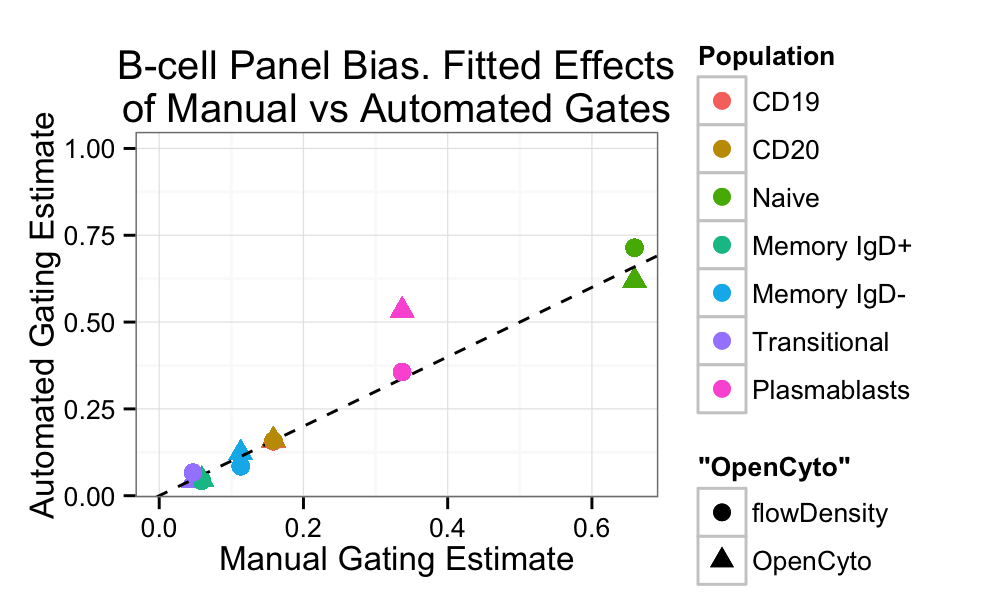
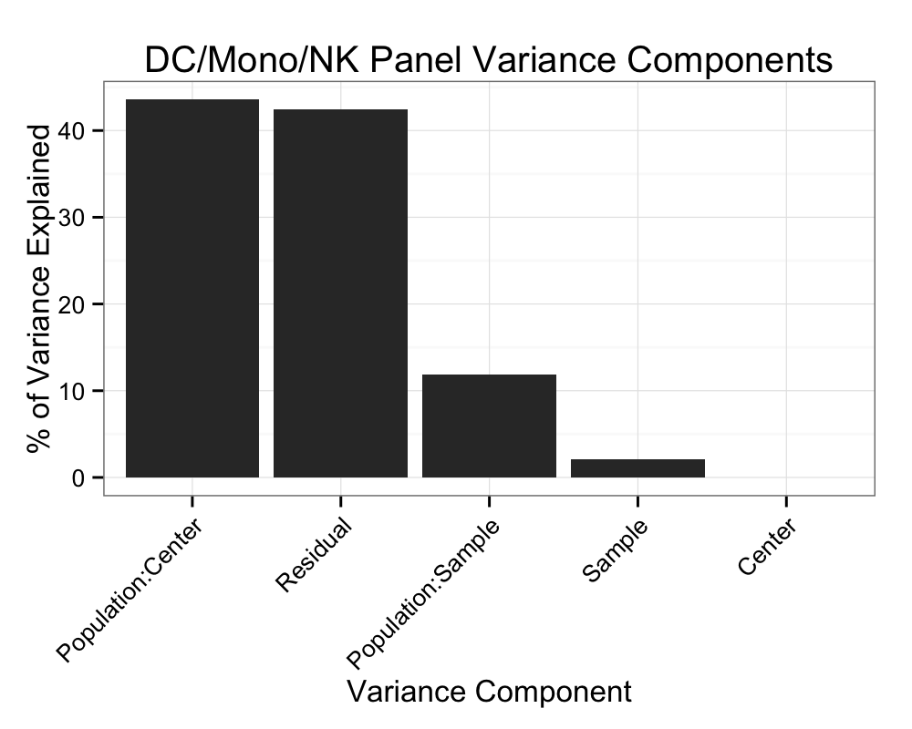

Comparison of Centralized Manual and Automated Gating Methods
========================================================

* We compare OpenCyto and flowDensity against centralized manual gating for the SeraCare Lyoplate samples on five staining panels.  

```{r load_libraries,echo=FALSE}
suppressPackageStartupMessages({
  require(tools);
  require(data.table)
  require(reshape)
  require(knitr)
  require(lme4)
  require(car)
  require(ggplot2)
  require(languageR)
  require(Kmisc)
  require(contrast)
  require(multcomp)
                               })
```

```{r add_javascript}
options(markdown.HTML.header = unlist(
  sapply(system.file('misc', c('vignette.css', 'datatables.txt'), package = 'knitr'), readLines)
  )
)
```

```{r load_data,echo=FALSE,cache=FALSE,cache.extra=md5sum("../../data/MergedTables.rda")}
load("../../data/MergedTables.rda")
```
 
# B-cell panel

```{r bcell_cleanup,echo=2}
  BCELL <- data.table(BCELL)
  summary(BCELL)
```

* We see that the manual method has more rows and there are some `NAs` in the data

```{r bcell_inspect}
  unique(BCELL[is.na(Proportion),list(Center,File,Method)])
  unique(BCELL[Proportion>1,list(Center,Population,Method)])
```

* The `NAs` come from Yale, and the file is not defined. This seems to be some missing data.
* There are "proportions" greater than 1 for a population that is NA as well. 
* We'll remove these and see if the rest is complete

```{r bcell_removeNA,echo=FALSE,message=FALSE,results='asis'}
  BCELL <- na.omit(BCELL)
  m<-melt(BCELL,id=c("Sample","Center","Population","Method"),measure="Proportion")
  kable(cast(m,Method~Population),format='html',table.attr='id="bcell_balance"')
```
<br>
* Okay, now things look nicely balanced. We check if the range of the data makes sense for proportions. 


`range(m$value)=[``r range(m$value)``]`

* That looks as expected. We're good to go.

<script type="text/javascript" charset="utf-8">
  $(document).ready(function() {
    $('#bcell_balance').dataTable();
	} );
</script>

* The last thing we need to do is annotation the samples with a technical replicate id.

```{r bcell_techrep_annotate}
  BCELL[,Replicate:=gl(nrow(.SD),1),list(Sample,Center,Population,Method)]
  BCELL<-BCELL[Population!="Lymphocytes"]
  BCELL[,Population:=factor(Population)]
```


## Mixed effects model for the B-cell panel

We want to model variability between centers, between subjects, and contrast gating methods for each cell population.

### Raw data

```{r bcell_boxplot,fig.width=10,fig.height=5,fig.cap="Boxplots of log proportions for each center and cell population by subject and gating method.",cache=FALSE,dpi=300}
  df<-cast(BCELL,Sample+Center+Method~Population+Replicate,value="Proportion")
  BCELL <- BCELL[,lp:=logit(Proportion,adjust=0.00001)]
  BCELL <- BCELL[,logp:=log(Proportion)]
  pops <- levels(BCELL$Population)
  setkey(BCELL,Population)
  ggplot(BCELL[pops[c(3,5,7)]])+geom_boxplot(aes(y=Proportion,x=Center,fill=Method))+facet_grid(Population~Sample,scales="free")+theme(axis.text.x=element_text(angle=45,hjust=1))+ggtitle("Raw B-cell data")
```

## Mixed Model for B-cell Panel

How we'll model this is the following. We'll have fixed effects for gating methods, cell populations and their interactions. That is becausewe want to esimate the effec of each gating method on each population.

We fit a random intercept for Sample and Center as well as for each level of Population:Center and Population:Sample. The idea here is that cell population estimates will vary from center to center and from sample to sample, by more than just a fixed offset. 

We fit the reponse (proportions) on the logit scale.

## Model fit and tests of gating contrasts

```{r bcell_anova,cache=FALSE}
#Estimate fixed effects for population and method and their interaction
#Random effects for center and sample, as random intercept for each population:center and population:Sample
  mer<-lmer(lp~Population*Method+(1|Center/Population)+(1|Sample/Population),BCELL[Population!="Lymphocytes"],REML=FALSE,verbose=FALSE)
  mer0 <- lm(lp~Population*Method,BCELL[Population!="Lymphocytes"])
  #contrasts
  with(BCELL[Population!="Lymphocytes"],cnt1<<-contrast(mer0,a=list(Population=levels(Population),Method="Manual"),list(Population=levels(Population),Method="OpenCyto")))  
  with(BCELL[Population!="Lymphocytes"],cnt2<<-contrast(mer0,list(Population=levels(Population),Method="Manual"),list(Population=levels(Population),Method="flowDensity")))

  #Hypothesis names
    rownames(cnt1$X) <-  cnt1$Population
    rownames(cnt2$X) <-  cnt2$Population
  #OpenCyto
  summary(glht(mer,linfct=cnt1$X))

  #flowDensity
  summary(glht(mer,linfct=cnt2$X))
```

### MSE (Variance + Bias)

```{r bcell_mse}
mse<-cbind(BCELL,fixr=getME(mer,'X')%*%fixef(mer)+resid(mer),fix=getME(mer,'X')%*%fixef(mer))
setnames(mse,c("fixr.V1","fix.V1"),c("fixr","fix"))

mse<-melt(mse[,list(Manual=crossprod(.SD[Method%in%"Manual",fix]-.SD[Method%in%"Manual",fixr])[1]/nrow(.SD[Method%in%"Manual"]),flowDensity=crossprod(.SD[Method%in%"Manual",fix]-.SD[Method%in%"flowDensity",fixr])[1]/nrow(.SD[Method%in%"Manual"]),OpenCyto=crossprod(.SD[Method%in%"Manual",fix]-.SD[Method%in%"OpenCyto",fixr])[1]/nrow(.SD[Method%in%"Manual"])),list(Population)],id=c("Population"))

ggplot(mse)+geom_bar(aes(x=Population,y=value,fill=variable),stat="identity",position="dodge")+theme_bw()+ggtitle("Mean Squared Error for B-cell Panel")+scale_y_continuous("MSE")+scale_fill_discrete("Gating Method")+theme(axis.text.x=element_text(angle=90,hjust=1))
```

### Model fits and residuals


```{r bcell_summarize_fitted,echo=FALSE,fig.height=6,fig.width=12,dpi=200}
d <- data.frame(fit=fitted(mer),BCELL[Population!="Lymphocytes",],res=resid(mer),pg=BCELL[Population!="Lymphocytes",Method:Population])

  ggplot(d)+geom_boxplot(aes(x=pg,y=fit,fill=Method))+theme(axis.text.x=element_text(angle=90,hjust=1))+scale_y_continuous("fitted")+scale_x_discrete("Population:Gating Method")+scale_fill_discrete("Method")+ggtitle("Fitted Values (logit proportions) vs Method and Cell Population")+facet_wrap(~Sample,ncol=3)
```

```{r bcell_summarize_residuals,echo=FALSE,fig.height=5,fig.with=15,dpi=200,cache=FALSE}
  ggplot(d)+geom_boxplot(aes(x=pg,y=res,fill=Method))+theme(axis.text.x=element_text(angle=90,hjust=1))+scale_y_continuous("residuals")+scale_x_discrete("Population:Gating Method")+scale_fill_discrete("Method")+ggtitle("Residuals vs Method and Cell Population")+facet_wrap(~Sample,ncol=3)
  
   ggplot(d)+geom_point(aes(x=fit,y=res))+ggtitle("Residuals vs Fitted")

  ggplot(d)+geom_point(aes(x=Proportion,y=plogis(fit),col=Method))+ggtitle("Fitted vs Observed Proportions")+facet_grid(Center~Sample,scale="free")+geom_abline(aes(0,1),lty=2)+theme_bw()
```

### Bias

```{r bcell_bias,echo=FALSE,fig.width=5,fig.height=3,dpi=200}
  d<-data.frame(d,fixed=predict(mer,REform=0))

 d2<-cast(melt(d,id=c("Sample","Center","Population","Replicate","Method"),measure="fixed"),...~Method)

  ggplot(d2)+geom_point(aes(x=plogis(Manual),y=plogis(OpenCyto),shape="OpenCyto",color=Population),size=3)+geom_abline(aes(0,1),lty=2)+geom_point(aes(x=plogis(Manual),y=plogis(flowDensity),shape="flowDensity",color=Population),size=3)+theme_bw()+ggtitle(wrap("B-cell Panel Bias. Fitted Effects of Manual vs Automated Gates",width=35))+scale_y_continuous("Automated Gating Estimate")+scale_x_continuous("Manual Gating Estimate")

# Relative bias
  d3<-data.table(d)[,list(Method,diff.rel.pct=100*(.SD[,fixed]-.SD[Method=="Manual",fixed])/(.SD[Method=="Manual",fixed])),list(Sample,Center,Population,Replicate)]

ggplot(unique(d3[Method!="Manual"]))+geom_bar(aes(x=Population,y=diff.rel.pct,fill=Method),position="dodge",stat='identity')+coord_flip()+theme_bw()+scale_x_discrete("Cell Population")+scale_y_continuous("Percent Relative Difference")+ggtitle("B-cell Panel Bias as Percent Relative Difference")

# variance of log-proportions for plasmablasts
ggplot(BCELL[Population%in%c("Naive","Plasmablasts"),list(CV=var(log(Proportion))),list(Center,Method,Population)])+geom_boxplot(aes(y=CV,x=Method))+ggtitle("Distribution of Var(log(p)) across\nSubjects within Centers, by Gating Method")+theme_bw()+facet_wrap(~Population,scale="free")+scale_y_continuous("Var(log(proportion))")
```

### Variability

```{r bcell_variance_components,echo=FALSE,fig.width=5,fig.height=4,dpi=200,message=FALSE}
  #Extract Variance Components
 vc <- VarCorr(mer)
 foo<-capture.output({v <- as.numeric(print(vc,comp="Variance")[,3]);
 names(v) <- print(vc,comp="Variance")[,1]})
 v <- 100*v[order(v,decreasing=TRUE)]/sum(v)
 v <- melt(v)
  setnames(v,"VarComp")
  v<-data.frame(v,Component=rownames(v))
  v$Component <- ordered(v$Component,levels=v$Component)
    #Reorder the levels by descending magnitude
  ggplot(v,aes(x=Component,y=VarComp))+geom_bar(stat='identity')+ggtitle("B-cell Panel Variance Components")+scale_y_continuous("% of Variance Explained")+scale_x_discrete("Variance Component")+theme_bw()+theme(axis.text.x=element_text(angle=45,hjust=1))
  
```

### Variance of the residuals by gating method

```{r var_resid_bymethod_bcell,fig.width=8,fig.height=5,dpi=200}
  BCELL[,resid:=resid(mer),]
  ggplot(BCELL[,list(var=var(resid)),list(Population,Method)])+geom_bar(aes(x=Population,y=var,fill=Method),position="dodge",stat="identity")+ggtitle("Residual Variability by Gating Method")+theme_bw()+theme(axis.text.x=element_text(angle=90,hjust=1))+scale_y_continuous("Variance")
  ggplot(BCELL[,list(var=var(resid)),list(Population,Method,Center)])+geom_bar(aes(x=Population,y=var,fill=Method),position="dodge",stat="identity")+ggtitle("Residual Variability by Center")+theme_bw()+theme(axis.text.x=element_text(angle=90,hjust=1))+scale_y_continuous("Variance")+facet_wrap(~Center)

```

## Summary of B-cell Panel

We note several things: 
*  First, OpenCyto is slightly biased for the Plasmablast cell population. IT tends to overestimate it compared to the centralized manual gates.
* Second, most of the variability is sample-to-sample biological variability, followed by residual within-sample variation, and then center-to-center variation. 
* The most variable populations are the plasmablasts and the IgD+ subsets.

# T-cell panel

```{r Tcell,echo=FALSE}
  TCELLS <- data.table(TCELLS)
  summary(TCELLS)
  TCELLS <- na.omit(TCELLS)
```

* There are some `NAs` again.

```{r tcell_balance,results='asis'}
  m<-melt(TCELLS,id=c("Sample","Center","Population","Method"),measure="Proportion")
  kable(cast(m,Method~Population),format='html',table.attr='id="tcell_balance"')
```
<br>
For some reason there are more observations from flowDensity and Manual gating than OpenCyto.

```{r tcell_centers,results='asis'}
  kable(cast(m,Method~Center),format='html',table.attr='id="tcell_centers"')
```
* And we see the reason is that OpenCyto gating was not done on CIMR.
* We'll drop CIMR for the purposes of the analysis.

The range of the data looks okay.

`range(m$value)=[``r range(m$value)``]`


<script type="text/javascript" charset="utf-8">
  $(document).ready(function() {
    $('#tcell_balance').dataTable();
  } );
</script>
<script type="text/javascript" charset="utf-8">
  $(document).ready(function() {
    $('#tcell_center').dataTable();
  } );
</script>

* Annotate the technical replicates.

```{r tcell_techrep_annotate}
  TCELLS[,Replicate:=gl(nrow(.SD),1),list(Sample,Center,Population,Method)]
  TCELLS<-TCELLS[Population!="Lymphocytes"]
  TCELLS[,Population:=factor(Population)]
```

## Raw data for T-cell panel

```{r tcell_rawdata}
  TCELLS<-TCELLS[Center!="CIMR"] #drop CIMR
  df<-cast(TCELLS,Sample+Center+Method~Population+Replicate,value="Proportion")
  TCELLS <- TCELLS[,lp:=logit(Proportion,adjust=0.00001)]
  TCELLS <- TCELLS[,logp:=log(Proportion)]
  pops <- levels(TCELLS$Population)
  setkey(TCELLS,Population)
  ggplot(TCELLS[pops[c(3,5,12)]])+geom_boxplot(aes(y=Proportion,x=Center,fill=Method))+facet_grid(Population~Sample,scales="free")+theme(axis.text.x=element_text(angle=45,hjust=1))+ggtitle("Raw T-cell data")
```


## Mixed Model for T-cell Panel and tests of gating contrasts


We fit the mixed model to the T-cell panel.

```{r tcell_mixedmodel}
  mer<-lmer(lp~Population*Method+(1|Center/Population)+(1|Sample/Population),TCELLS[Population!="Lymphocytes"],REML=FALSE,verbose=FALSE)
  mer0 <- lm(lp~Population*Method,TCELLS[Population!="Lymphocytes"])
  #contrasts
  with(TCELLS[Population!="Lymphocytes"],cnt1<<-contrast(mer0,list(Population=levels(Population),Method="Manual"),list(Population=levels(Population),Method="OpenCyto")))  
  with(TCELLS[Population!="Lymphocytes"],cnt2<<-contrast(mer0,list(Population=levels(Population),Method="Manual"),list(Population=levels(Population),Method="flowDensity")))

  #Hypothesis names
    rownames(cnt1$X) <-  cnt1$Population
    rownames(cnt2$X) <-  cnt2$Population
  #OpenCyto
  summary(glht(mer,linfct=cnt1$X))

  #flowDensity
  summary(glht(mer,linfct=cnt2$X))
```

### MSE (Variance + Bias)

```{r tcell_mse}
mse<-cbind(TCELLS,fixr=getME(mer,'X')%*%fixef(mer)+resid(mer),fix=getME(mer,'X')%*%fixef(mer))
setnames(mse,c("fixr.V1","fix.V1"),c("fixr","fix"))

mse<-melt(mse[,list(Manual=crossprod(.SD[Method%in%"Manual",fix]-.SD[Method%in%"Manual",fixr])[1]/nrow(.SD[Method%in%"Manual"]),flowDensity=crossprod(.SD[Method%in%"Manual",fix]-.SD[Method%in%"flowDensity",fixr])[1]/nrow(.SD[Method%in%"Manual"]),OpenCyto=crossprod(.SD[Method%in%"Manual",fix]-.SD[Method%in%"OpenCyto",fixr])[1]/nrow(.SD[Method%in%"Manual"])),list(Population)],id=c("Population"))

ggplot(mse)+geom_bar(aes(x=Population,y=value,fill=variable),stat="identity",position="dodge")+theme_bw()+ggtitle("Mean Squared Error for T-cell Panel")+scale_y_continuous("MSE")+scale_fill_discrete("Gating Method")+theme(axis.text.x=element_text(angle=90,hjust=1))
```


```{r tcell_summarize_fitted,echo=FALSE,fig.height=6,fig.width=12,dpi=200}
d <- data.frame(fit=fitted(mer),TCELLS[Population!="Lymphocytes",],res=resid(mer),pg=TCELLS[Population!="Lymphocytes",Method:Population])

  ggplot(d)+geom_boxplot(aes(x=pg,y=fit,fill=Method))+theme(axis.text.x=element_text(angle=90,hjust=1))+scale_y_continuous("fitted")+scale_x_discrete("Population:Gating Method")+scale_fill_discrete("Method")+ggtitle("Fitted Values (logit proportions) vs Method and Cell Population")+facet_wrap(~Sample,ncol=3)
```

```{r tcell_summarize_residuals,echo=FALSE,fig.height=5,fig.with=15,dpi=200,cache=FALSE}
  ggplot(d)+geom_boxplot(aes(x=pg,y=res,fill=Method))+theme(axis.text.x=element_text(angle=90,hjust=1))+scale_y_continuous("residuals")+scale_x_discrete("Population:Gating Method")+scale_fill_discrete("Method")+ggtitle("Residuals vs Method and Cell Population")+facet_wrap(~Sample,ncol=3)
  
   ggplot(d)+geom_point(aes(x=fit,y=res))+ggtitle("Residuals vs Fitted")

  ggplot(d)+geom_point(aes(x=Proportion,y=plogis(fit),col=Method))+ggtitle("Fitted vs Observed Proportions")+facet_grid(Center~Sample,scale="free")+geom_abline(aes(0,1),lty=2)+theme_bw()
```

### Bias

```{r tcell_bias,echo=FALSE,fig.width=8,fig.height=5,dpi=200}
  d<-data.frame(d,fixed=predict(mer,REform=0))

 d2<-cast(melt(d,id=c("Sample","Center","Population","Replicate","Method"),measure="fixed"),...~Method)

  ggplot(d2)+geom_point(aes(x=plogis(Manual),y=plogis(OpenCyto),shape="OpenCyto",color=Population),size=3)+geom_abline(aes(0,1),lty=2)+geom_point(aes(x=plogis(Manual),y=plogis(flowDensity),shape="flowDensity",color=Population),size=3)+theme_bw()+ggtitle(wrap("T-cell Panel Bias. Fitted Effects of Manual vs Automated Gates",width=35))+scale_y_continuous("Automated Gating Estimate")+scale_x_continuous("Manual Gating Estimate")

# Relative bias
  d3<-data.table(d)[,list(Method,diff.rel.pct=100*(.SD[,fixed]-.SD[Method=="Manual",fixed])/(.SD[Method=="Manual",fixed])),list(Sample,Center,Population,Replicate)]

ggplot(unique(d3[Method!="Manual"]))+geom_bar(aes(x=Population,y=diff.rel.pct,fill=Method),position="dodge",stat='identity')+coord_flip()+theme_bw()+scale_x_discrete("Cell Population")+scale_y_continuous("Percent Relative Difference")+ggtitle("T-cell Panel Bias as Percent Relative Difference")

# CV for CD8, CD4 CM, CD4 Activated
ggplot(TCELLS[Population%in%c("CD8 Effector Memory","CD8 Central Memory","CD8 Naive"),list(CV=var(log(Proportion))),list(Center,Method,Population)])+geom_boxplot(aes(y=CV,x=Method))+ggtitle("Distribution of Var(log(proportion)) \nacross Subjects within Centers, by Gating Method")+theme_bw()+facet_wrap(~Population)+scale_y_continuous("Var(log(proportion))")
```

### Variability

```{r tcell_variance_components,echo=FALSE,fig.width=5,fig.height=4,dpi=200,message=FALSE}
  #Extract Variance Components
 vc <- VarCorr(mer)
 foo<-capture.output({v <- as.numeric(print(vc,comp="Variance")[,3]);
 names(v) <- print(vc,comp="Variance")[,1]})
 v <- 100*v[order(v,decreasing=TRUE)]/sum(v)
 v <- melt(v)
  setnames(v,"VarComp")
  v<-data.frame(v,Component=rownames(v))
  v$Component<-ordered(v$Component,levels=v$Component)
  #Reorder the levels by descending magnitude
  ggplot(v,aes(x=Component,y=VarComp))+geom_bar(stat='identity')+ggtitle("T-cell Panel Variance Components")+scale_y_continuous("% of Variance Explained")+scale_x_discrete("Variance Component")+theme_bw()+theme(axis.text.x=element_text(angle=45,hjust=1))
```

### Variance of the residuals by gating method

```{r var_resid_bymethod_tcell,fig.width=8,fig.height=5,dpi=200}
  TCELLS[,resid:=resid(mer),]
  ggplot(TCELLS[,list(var=var(resid)),list(Population,Method)])+geom_bar(aes(x=Population,y=var,fill=Method),position="dodge",stat="identity")+ggtitle("Residual Variability by Gating Method")+theme_bw()+theme(axis.text.x=element_text(angle=90,hjust=1))+scale_y_continuous("Variance")
  ggplot(TCELLS[,list(var=var(resid)),list(Population,Method,Center)])+geom_bar(aes(x=Population,y=var,fill=Method),position="dodge",stat="identity")+ggtitle("Residual Variability by Center")+theme_bw()+theme(axis.text.x=element_text(angle=90,hjust=1))+scale_y_continuous("Variance")+facet_wrap(~Center)

```

## Summary of T-cell Panel

A couple of the CD8 populations exhibit some bias, but again, they are more consistent across subjects and centers than the manual gating.

#######################################
#######################################


# T-helper Panel

```{r Thelper,echo=FALSE}
  THELPER <- data.table(THELPER)
  summary(THELPER)
  THELPER <- na.omit(THELPER)
  THELPER<-THELPER[!Population%in%c("Lymphocytes","CD3","CD4","CD8")]
```

* There are some `NAs` again.

```{r thelper_balance,results='asis'}
  m<-melt(THELPER,id=c("Sample","Center","Population","Method"),measure="Proportion")
  kable(cast(m,Method~Population),format='html',table.attr='id="thelper_balance"')
```
<br>

```{r thelper_centers,results='asis'}
  kable(cast(m,Method~Center),format='html',table.attr='id="thelper_centers"')
  kable(cast(m,Method~Population),format='html',table.attr='id="thelper_populations"')

```
Things look balanced, and we have removed the Lymphocytes, CD8, CD4, and CD3 cells since they are not terminal populations.

The range of the data looks okay.

`range(m$value)=[``r range(m$value)``]`


<script type="text/javascript" charset="utf-8">
  $(document).ready(function() {
    $('#thelper_balance').dataTable();
  } );
</script>
<script type="text/javascript" charset="utf-8">
  $(document).ready(function() {
    $('#thelper_center').dataTable();
  } );
</script>
<script type="text/javascript" charset="utf-8">
  $(document).ready(function() {
    $('#thelper_populations').dataTable();
  } );
</script>

* Annotate the technical replicates.

```{r thelper_techrep_annotate}
  THELPER[,Replicate:=gl(nrow(.SD),1),list(Sample,Center,Population,Method)]
  THELPER<-THELPER[Population!="Lymphocytes"]
  THELPER[,Population:=factor(Population)]
```

## Raw data for T-helper panel 

```{r thelper_rawdata}
  df<-cast(THELPER,Sample+Center+Method~Population+Replicate,value="Proportion")
  THELPER <- THELPER[,lp:=logit(Proportion,adjust=0.00001)]
  THELPER <- THELPER[,logp:=log(Proportion)]
  pops <- levels((THELPER$Population))
  setkey(THELPER,Population)
  ggplot(THELPER[pops[1:3]])+geom_boxplot(aes(y=Proportion,x=Center,fill=Method))+facet_grid(Population~Sample,scales="free")+theme(axis.text.x=element_text(angle=45,hjust=1))+ggtitle("Raw T-helper data")
```


## Mixed Model for T-helper panel and tests of gating contrasts

We fit the mixed model to the T-helper panel.

```{r thelper_mixedmodel}
  mer<-lmer(lp~Population*Method+(1|Center/Population)+(1|Sample/Population),THELPER[Population!="Lymphocytes"],REML=FALSE,verbose=FALSE)
  mer0 <- lm(lp~Population*Method,THELPER[Population!="Lymphocytes"])
  #contrasts
  with(THELPER[Population!="Lymphocytes"],cnt1<<-contrast(mer0,list(Population=levels(Population),Method="Manual"),list(Population=levels(Population),Method="OpenCyto")))  
  with(THELPER[Population!="Lymphocytes"],cnt2<<-contrast(mer0,list(Population=levels(Population),Method="Manual"),list(Population=levels(Population),Method="flowDensity")))

  #Hypothesis names
      rownames(cnt1$X) <-  cnt1$Population
    rownames(cnt2$X) <-  cnt2$Population
  #OpenCyto
  summary(glht(mer,linfct=cnt1$X))

  #flowDensity
  summary(glht(mer,linfct=cnt2$X))
```

### MSE (Variance + Bias)

```{r thelper_mse}
mse<-cbind(THELPER,fixr=getME(mer,'X')%*%fixef(mer)+resid(mer),fix=getME(mer,'X')%*%fixef(mer))
setnames(mse,c("fixr.V1","fix.V1"),c("fixr","fix"))


mse<-melt(mse[,list(Manual=crossprod(.SD[Method%in%"Manual",fix]-.SD[Method%in%"Manual",fixr])[1]/nrow(.SD[Method%in%"Manual"]),flowDensity=crossprod(.SD[Method%in%"Manual",fix]-.SD[Method%in%"flowDensity",fixr])[1]/nrow(.SD[Method%in%"Manual"]),OpenCyto=crossprod(.SD[Method%in%"Manual",fix]-.SD[Method%in%"OpenCyto",fixr])[1]/nrow(.SD[Method%in%"Manual"])),list(Population)],id=c("Population"))

ggplot(mse)+geom_bar(aes(x=Population,y=value,fill=variable),stat="identity",position="dodge")+theme_bw()+ggtitle("Mean Squared Error for T-helper Panel")+scale_y_continuous("MSE")+scale_fill_discrete("Gating Method")+theme(axis.text.x=element_text(angle=90,hjust=1))
```


```{r thelper_summarize_fitted,echo=FALSE,fig.height=6,fig.width=12,dpi=200}
d <- data.frame(fit=fitted(mer),THELPER[Population!="Lymphocytes",],res=resid(mer),pg=THELPER[Population!="Lymphocytes",Method:Population])

  ggplot(d)+geom_boxplot(aes(x=pg,y=fit,fill=Method))+theme(axis.text.x=element_text(angle=90,hjust=1))+scale_y_continuous("fitted")+scale_x_discrete("Population:Gating Method")+scale_fill_discrete("Method")+ggtitle("Fitted Values (logit proportions) vs Method and Cell Population")+facet_wrap(~Sample,ncol=3)
```

```{r thelper_summarize_residuals,echo=FALSE,fig.height=5,fig.with=15,dpi=200,cache=FALSE}
  ggplot(d)+geom_boxplot(aes(x=pg,y=res,fill=Method))+theme(axis.text.x=element_text(angle=90,hjust=1))+scale_y_continuous("residuals")+scale_x_discrete("Population:Gating Method")+scale_fill_discrete("Method")+ggtitle("Residuals vs Method and Cell Population")+facet_wrap(~Sample,ncol=3)
  
   ggplot(d)+geom_point(aes(x=fit,y=res))+ggtitle("Residuals vs Fitted")

  ggplot(d)+geom_point(aes(x=Proportion,y=plogis(fit),col=Method))+ggtitle("Fitted vs Observed Proportions")+facet_grid(Center~Sample,scale="free")+geom_abline(aes(0,1),lty=2)+theme_bw()
```

### Bias

```{r thelper_bias,echo=FALSE,fig.width=8,fig.height=5,dpi=200}
  d<-data.frame(d,fixed=predict(mer,REform=0))

 d2<-cast(melt(d,id=c("Sample","Center","Population","Replicate","Method"),measure="fixed"),...~Method)

  ggplot(d2)+geom_point(aes(x=plogis(Manual),y=plogis(OpenCyto),shape="OpenCyto",color=Population),size=3)+geom_abline(aes(0,1),lty=2)+geom_point(aes(x=plogis(Manual),y=plogis(flowDensity),shape="flowDensity",color=Population),size=3)+theme_bw()+ggtitle(wrap("T-helper Panel Bias. Fitted Effects of Manual vs Automated Gates",width=35))+scale_y_continuous("Automated Gating Estimate")+scale_x_continuous("Manual Gating Estimate")

# Relative bias
  d3<-data.table(d)[,list(Method,diff.rel.pct=100*(.SD[,fixed]-.SD[Method=="Manual",fixed])/(.SD[Method=="Manual",fixed])),list(Sample,Center,Population,Replicate)]

ggplot(unique(d3[Method!="Manual"]))+geom_bar(aes(x=Population,y=diff.rel.pct,fill=Method),position="dodge",stat='identity')+coord_flip()+theme_bw()+scale_x_discrete("Cell Population")+scale_y_continuous("Percent Relative Difference")+ggtitle("T-helper Panel Bias as Percent Relative Difference")

# CV for CD8, CD4 CM, CD4 Activated
ggplot(THELPER[Population%in%c("CD8 Th2","CD8 Th1","CD4 Th2","CD4 Th1"),list(CV=var(log(Proportion))),list(Center,Method,Population)])+geom_boxplot(aes(y=CV,x=Method))+ggtitle("Distribution of Var(log(proportion)) across\n Subjects within Centers, by Gating Method")+theme_bw()+facet_wrap(~Population)+scale_y_continuous("Var(log(proportion))")
```

### Variability

```{r thelper_variance_components,echo=FALSE,fig.width=5,fig.height=4,dpi=200,message=FALSE}
  #Extract Variance Components
 vc <- VarCorr(mer)
 foo<-capture.output({v <- as.numeric(print(vc,comp="Variance")[,3]);
 names(v) <- print(vc,comp="Variance")[,1]})
 v <- 100*v[order(v,decreasing=TRUE)]/sum(v)
 v <- melt(v)
  setnames(v,"VarComp")
  v<-data.frame(v,Component=rownames(v))
  v$Component<-ordered(v$Component,levels=v$Component)
  #Reorder the levels by descending magnitude
  ggplot(v,aes(x=Component,y=VarComp))+geom_bar(stat='identity')+ggtitle("T-helper Panel Variance Components")+scale_y_continuous("% of Variance Explained")+scale_x_discrete("Variance Component")+theme_bw()+theme(axis.text.x=element_text(angle=45,hjust=1))
```

### Variance of the residuals by gating method

```{r var_resid_bymethod_thelper,fig.width=8,fig.height=5,dpi=200}
  THELPER[,resid:=resid(mer),]
  ggplot(THELPER[,list(var=var(resid)),list(Population,Method)])+geom_bar(aes(x=Population,y=var,fill=Method),position="dodge",stat="identity")+ggtitle("Residual Variability by Gating Method")+theme_bw()+theme(axis.text.x=element_text(angle=90,hjust=1))+scale_y_continuous("Variance")
  ggplot(THELPER[,list(var=var(resid)),list(Population,Method,Center)])+geom_bar(aes(x=Population,y=var,fill=Method),position="dodge",stat="identity")+ggtitle("Residual Variability by Center")+theme_bw()+theme(axis.text.x=element_text(angle=90,hjust=1))+scale_y_continuous("Variance")+facet_wrap(~Center)


```

## Summary of T-helper Panel

The T-helper panel seems to have failed, as we have a lot of bias in the Th1 and Th2 populations.

#######################################
#######################################


# DC / Mono / NK Panel


```{r dcmono,echo=FALSE}
  DC_MONO <- data.table(DC_MONO)
  summary(DC_MONO)
  DC_MONO <- na.omit(DC_MONO)
```

* There are some `NAs` again.

```{r dcmono_balance,results='asis'}
  m<-melt(DC_MONO,id=c("Sample","Center","Population","Method"),measure="Proportion")
  kable(cast(m,Method~Population),format='html',table.attr='id="dcmono_balance"')
```
<br>

We are missing some populations. 

```{r dcmono_centers,results='asis'}
  kable(cast(m,Method~Center),format='html',table.attr='id="dcmono_centers"')
```

```{r dcmono_drop_pops}
  DC_MONO<-DC_MONO[!Population%in%c("Monocytes","CD14-Lineage+","CD14+CD16-")]
  DC_MONO<-DC_MONO[,Population:=factor(Population)]
  m<-melt(DC_MONO,id=c("Sample","Center","Population","Method"),measure="Proportion")
```

The range of the data looks okay.

`range(m$value)=[``r range(m$value)``]`


<script type="text/javascript" charset="utf-8">
  $(document).ready(function() {
    $('#dcmono_balance').dataTable();
  } );
</script>
<script type="text/javascript" charset="utf-8">
  $(document).ready(function() {
    $('#dcmono_center').dataTable();
  } );
</script>

* Annotate the technical replicates.

```{r dcmono_techrep_annotate}
  DC_MONO[,Replicate:=gl(nrow(.SD),1),list(Sample,Center,Population,Method)]
```

## Raw data for DC/Mono/NK panel

```{r dcmono_rawdata}
  df<-cast(DC_MONO,Sample+Center+Method~Population+Replicate,value="Proportion")
  DC_MONO <- DC_MONO[,lp:=logit(Proportion,adjust=0.00001)]
  DC_MONO <- DC_MONO[,logp:=log(Proportion)]
  pops <- levels((DC_MONO$Population))
  setkey(DC_MONO,Population)
  ggplot(DC_MONO[pops[c(1:3)]])+geom_boxplot(aes(y=Proportion,x=Center,fill=Method))+facet_grid(Population~Sample,scales="free")+theme(axis.text.x=element_text(angle=45,hjust=1))+ggtitle("Raw DC/Mono/NK data")
```

## Mixed Model for DC/Mono/NK Panel and tests of gating contrasts

We fit the mixed model to the DC/Mono/NK panel.

```{r dcmono_mixedmodel}
  mer<-lmer(lp~Population*Method+(1|Center/Population)+(1|Sample/Population),DC_MONO[Population!="Lymphocytes"],REML=FALSE,verbose=FALSE)
  mer0 <- lm(lp~Population*Method,DC_MONO[Population!="Lymphocytes"])
  #contrasts
  with(DC_MONO[Population!="Lymphocytes"],cnt1<<-contrast(mer0,list(Population=levels(Population),Method="Manual"),list(Population=levels(Population),Method="OpenCyto")))  
  with(DC_MONO[Population!="Lymphocytes"],cnt2<<-contrast(mer0,list(Population=levels(Population),Method="Manual"),list(Population=levels(Population),Method="flowDensity")))

  #Hypothesis names
    rownames(cnt1$X) <-  cnt1$Population
    rownames(cnt2$X) <-  cnt2$Population
#OpenCyto
  summary(glht(mer,linfct=cnt1$X))

  #flowDensity
  summary(glht(mer,linfct=cnt2$X))
```

### MSE (Variance + Bias)

```{r dcmono_mse}
mse<-cbind(DC_MONO,fixr=getME(mer,'X')%*%fixef(mer)+resid(mer),fix=getME(mer,'X')%*%fixef(mer))
setnames(mse,c("fixr.V1","fix.V1"),c("fixr","fix"))


mse<-melt(mse[,list(Manual=crossprod(.SD[Method%in%"Manual",fix]-.SD[Method%in%"Manual",fixr])[1]/nrow(.SD[Method%in%"Manual"]),flowDensity=crossprod(.SD[Method%in%"Manual",fix]-.SD[Method%in%"flowDensity",fixr])[1]/nrow(.SD[Method%in%"Manual"]),OpenCyto=crossprod(.SD[Method%in%"Manual",fix]-.SD[Method%in%"OpenCyto",fixr])[1]/nrow(.SD[Method%in%"Manual"])),list(Population)],id=c("Population"))

ggplot(mse)+geom_bar(aes(x=Population,y=value,fill=variable),stat="identity",position="dodge")+theme_bw()+ggtitle("Mean Squared Error for DC/Mono/NK Panel")+scale_y_continuous("MSE")+scale_fill_discrete("Gating Method")+theme(axis.text.x=element_text(angle=90,hjust=1))
```


```{r dcmono_summarize_fitted,echo=FALSE,fig.height=6,fig.width=12,dpi=200}
d <- data.frame(fit=fitted(mer),DC_MONO[Population!="Lymphocytes",],res=resid(mer),pg=DC_MONO[Population!="Lymphocytes",Method:Population])

  ggplot(d)+geom_boxplot(aes(x=pg,y=fit,fill=Method))+theme(axis.text.x=element_text(angle=90,hjust=1))+scale_y_continuous("fitted")+scale_x_discrete("Population:Gating Method")+scale_fill_discrete("Method")+ggtitle("Fitted Values (logit proportions) vs Method and Cell Population")+facet_wrap(~Sample,ncol=3)
```

```{r dcmono_summarize_residuals,echo=FALSE,fig.height=5,fig.with=15,dpi=200,cache=FALSE}
  ggplot(d)+geom_boxplot(aes(x=pg,y=res,fill=Method))+theme(axis.text.x=element_text(angle=90,hjust=1))+scale_y_continuous("residuals")+scale_x_discrete("Population:Gating Method")+scale_fill_discrete("Method")+ggtitle("Residuals vs Method and Cell Population")+facet_wrap(~Sample,ncol=3)
  
   ggplot(d)+geom_point(aes(x=fit,y=res))+ggtitle("Residuals vs Fitted")

  ggplot(d)+geom_point(aes(x=Proportion,y=plogis(fit),col=Method))+ggtitle("Fitted vs Observed Proportions")+facet_grid(Center~Sample,scale="free")+geom_abline(aes(0,1),lty=2)+theme_bw()
```

### Bias

```{r dcmono_bias,echo=FALSE,fig.width=8,fig.height=5,dpi=200}
  d<-data.frame(d,fixed=predict(mer,REform=0))

 d2<-cast(melt(d,id=c("Sample","Center","Population","Replicate","Method"),measure="fixed"),...~Method)

  ggplot(d2)+geom_point(aes(x=plogis(Manual),y=plogis(OpenCyto),shape="OpenCyto",color=Population),size=3)+geom_abline(aes(0,1),lty=2)+geom_point(aes(x=plogis(Manual),y=plogis(flowDensity),shape="flowDensity",color=Population),size=3)+theme_bw()+ggtitle(wrap("DC/Mono/NK Panel Bias. Fitted Effects of Manual vs Automated Gates",width=35))+scale_y_continuous("Automated Gating Estimate")+scale_x_continuous("Manual Gating Estimate")

# Relative bias
  d3<-data.table(d)[,list(Method,diff.rel.pct=100*(.SD[,fixed]-.SD[Method=="Manual",fixed])/(.SD[Method=="Manual",fixed])),list(Sample,Center,Population,Replicate)]

ggplot(unique(d3[Method!="Manual"]))+geom_bar(aes(x=Population,y=diff.rel.pct,fill=Method),position="dodge",stat='identity')+coord_flip()+theme_bw()+scale_x_discrete("Cell Population")+scale_y_continuous("Percent Relative Difference")+ggtitle("DC/Mono/NK Panel Bias as Percent Relative Difference")

# CV for CD8, CD4 CM, CD4 Activated
ggplot(DC_MONO[Population%in%c("CD11c+CD123-","HLADR+","CD16+CD56-"),list(CV=var(log(Proportion))),list(Center,Method,Population)])+geom_boxplot(aes(y=CV,x=Method))+ggtitle("Distribution of Var(log(proportion)) across\n Subjects within Centers, by Gating Method")+theme_bw()+facet_wrap(~Population)+scale_y_continuous("Var(log(proportion))")
```

### Variability

```{r dcmono_variance_components,echo=FALSE,fig.width=5,fig.height=4,dpi=200,message=FALSE}
  #Extract Variance Components
 vc <- VarCorr(mer)
 foo<-capture.output({v <- as.numeric(print(vc,comp="Variance")[,3]);
 names(v) <- print(vc,comp="Variance")[,1]})
 v <- 100*v[order(v,decreasing=TRUE)]/sum(v)
 v <- melt(v)
  setnames(v,"VarComp")
  v<-data.frame(v,Component=rownames(v))
  v$Component<-ordered(v$Component,levels=v$Component)
  #Reorder the levels by descending magnitude
  ggplot(v,aes(x=Component,y=VarComp))+geom_bar(stat='identity')+ggtitle("DC/Mono/NK Panel Variance Components")+scale_y_continuous("% of Variance Explained")+scale_x_discrete("Variance Component")+theme_bw()+theme(axis.text.x=element_text(angle=45,hjust=1))
```

### Variance of the residuals by gating method

```{r var_resid_bymethod_dcmono,fig.width=8,fig.height=5,dpi=200}
  DC_MONO[,resid:=resid(mer),]
  ggplot(DC_MONO[,list(var=var(resid)),list(Population,Method)])+geom_bar(aes(x=Population,y=var,fill=Method),position="dodge",stat="identity")+ggtitle("Residual Variability by Gating Method")+theme_bw()+theme(axis.text.x=element_text(angle=90,hjust=1))+scale_y_continuous("Variance")
  ggplot(DC_MONO[,list(var=var(resid)),list(Population,Method,Center)])+geom_bar(aes(x=Population,y=var,fill=Method),position="dodge",stat="identity")+ggtitle("Residual Variability by Center")+theme_bw()+theme(axis.text.x=element_text(angle=90,hjust=1))+scale_y_continuous("Variance")+facet_wrap(~Center)


```

## Summary of DC/Mono/NK Panel

* Some bias in some populations.
* Population-specific center-to-center variability is largest, followed by residual variation.


#######################################
#######################################

#  Treg Panel


```{r treg,echo=FALSE}
  TREG <- data.table(TREG)
  summary(TREG)
  TREG <- na.omit(TREG)
```

* There are some `NAs` again.

```{r treg_balance,results='asis'}
  m<-melt(TREG,id=c("Sample","Center","Population","Method"),measure="Proportion")
  kable(cast(m,Method~Population),format='html',table.attr='id="treg_balance"')
```
<br>

Populations are balanced.

```{r treg_centers,results='asis'}
  kable(cast(m,Method~Center),format='html',table.attr='id="treg_centers"')
```

Centers are also balanced 

We drop Lymphocytes, CD3 and CD4.
```{r treg_drop_pops}
  TREG<-TREG[!Population%in%c("Lymphocytes","CD3","CD4")]
  TREG<-TREG[,Population:=factor(Population)]
  m<-melt(TREG,id=c("Sample","Center","Population","Method"),measure="Proportion")
```

The range of the data looks okay.

`range(m$value)=[``r range(m$value)``]`


<script type="text/javascript" charset="utf-8">
  $(document).ready(function() {
    $('#treg_balance').dataTable();
  } );
</script>
<script type="text/javascript" charset="utf-8">
  $(document).ready(function() {
    $('#treg_center').dataTable();
  } );
</script>

* Annotate the technical replicates.

```{r treg_techrep_annotate}
  TREG[,Replicate:=gl(nrow(.SD),1),list(Sample,Center,Population,Method)]
```

## Raw data for T-reg panel

```{r treg_rawdata}
  df<-cast(TREG,Sample+Center+Method~Population+Replicate,value="Proportion")
  TREG <- TREG[,lp:=logit(Proportion,adjust=0.00001)]
  TREG <- TREG[,logp:=log(Proportion)]
  pops <- levels((TREG$Population))
  setkey(TREG,Population)
  ggplot(TREG[pops[c(1:3,5)]])+geom_boxplot(aes(y=Proportion,x=Center,fill=Method))+facet_grid(Population~Sample,scales="free")+theme(axis.text.x=element_text(angle=45,hjust=1))+ggtitle("Raw DC/Mono/NK data")
```

## Mixed Model for T-reg Panel and tests of gating contrasts

We fit the mixed model to the T-reg panel.

```{r treg_mixedmodel}
  mer<-lmer(lp~Population*Method+(1|Center/Population)+(1|Sample/Population),TREG[Population!="Lymphocytes"],REML=FALSE,verbose=FALSE)
  mer0 <- lm(lp~Population*Method,TREG[Population!="Lymphocytes"])
  #contrasts
  with(TREG[Population!="Lymphocytes"],cnt1<<-contrast(mer0,a=list(Population=levels(Population),Method="Manual"),b=list(Population=levels(Population),Method="OpenCyto")))  
 # with(BCELL[Population!="Lymphocytes"],cnt2<<-contrast(mer0,list(Population=levels(Population),Method="Manual"),list(Population=levels(Population),Method="flowDensity")))
  
  rownames(cnt1$X) <-  cnt1$Population

  #Hypothesis names
  #OpenCyto
  summary(glht(mer,linfct=cnt1$X))

  #flowDensity
  #summary(glht(mer,linfct=cnt2$X))
```


### MSE (Variance + Bias)

```{r treg_mse}
mse<-cbind(TREG,fixr=getME(mer,'X')%*%fixef(mer)+resid(mer),fix=getME(mer,'X')%*%fixef(mer))
setnames(mse,c("fixr.V1","fix.V1"),c("fixr","fix"))

mse<-melt(mse[,list(Manual=crossprod(.SD[Method%in%"Manual",fix]-.SD[Method%in%"Manual",fixr])[1]/nrow(.SD[Method%in%"Manual"]),flowDensity=crossprod(.SD[Method%in%"Manual",fix]-.SD[Method%in%"flowDensity",fixr])[1]/nrow(.SD[Method%in%"Manual"]),OpenCyto=crossprod(.SD[Method%in%"Manual",fix]-.SD[Method%in%"OpenCyto",fixr])[1]/nrow(.SD[Method%in%"Manual"])),list(Population)],id=c("Population"))

ggplot(mse)+geom_bar(aes(x=Population,y=value,fill=variable),stat="identity",position="dodge")+theme_bw()+ggtitle("Mean Squared Error for T-reg Panel")+scale_y_continuous("MSE")+scale_fill_discrete("Gating Method")+theme(axis.text.x=element_text(angle=90,hjust=1))
```

```{r treg_summarize_fitted,echo=FALSE,fig.height=6,fig.width=12,dpi=200}
d <- data.frame(fit=fitted(mer),TREG[Population!="Lymphocytes",],res=resid(mer),pg=TREG[Population!="Lymphocytes",Method:Population])

  ggplot(d)+geom_boxplot(aes(x=pg,y=fit,fill=Method))+theme(axis.text.x=element_text(angle=90,hjust=1))+scale_y_continuous("fitted")+scale_x_discrete("Population:Gating Method")+scale_fill_discrete("Method")+ggtitle("Fitted Values (logit proportions) vs Method and Cell Population")+facet_wrap(~Sample,ncol=3)
```

```{r treg_summarize_residuals,echo=FALSE,fig.height=5,fig.with=15,dpi=200,cache=FALSE}
  ggplot(d)+geom_boxplot(aes(x=pg,y=res,fill=Method))+theme(axis.text.x=element_text(angle=90,hjust=1))+scale_y_continuous("residuals")+scale_x_discrete("Population:Gating Method")+scale_fill_discrete("Method")+ggtitle("Residuals vs Method and Cell Population")+facet_wrap(~Sample,ncol=3)
  
   ggplot(d)+geom_point(aes(x=fit,y=res))+ggtitle("Residuals vs Fitted")

  ggplot(d)+geom_point(aes(x=Proportion,y=plogis(fit),col=Method))+ggtitle("Fitted vs Observed Proportions")+facet_grid(Center~Sample,scale="free")+geom_abline(aes(0,1),lty=2)+theme_bw()+scale_x_log10()+scale_y_log10()
```

### Bias

```{r treg_bias,echo=FALSE,fig.width=8,fig.height=5,dpi=200}
  d<-data.frame(d,fixed=predict(mer,REform=0))

 d2<-cast(melt(d,id=c("Sample","Center","Population","Replicate","Method"),measure="fixed"),...~Method)

  ggplot(d2)+geom_point(aes(x=plogis(Manual),y=plogis(OpenCyto),shape="OpenCyto",color=Population),size=3)+geom_abline(aes(0,1),lty=2)+#geom_point(aes(x=plogis(Manual),y=plogis(flowDensity),shape="flowDensity",color=Population),size=3)+
  theme_bw()+ggtitle(wrap("T-reg Panel Bias. Fitted Effects of Manual vs Automated Gates",width=35))+scale_y_continuous("Automated Gating Estimate")+scale_x_continuous("Manual Gating Estimate")+scale_x_log10()+scale_y_log10()

# Relative bias
  d3<-data.table(d)[,list(Method,diff.rel.pct=100*(.SD[,fixed]-.SD[Method=="Manual",fixed])/(.SD[Method=="Manual",fixed])),list(Sample,Center,Population,Replicate)]

ggplot(unique(d3[Method!="Manual"]))+geom_bar(aes(x=Population,y=diff.rel.pct,fill=Method),position="dodge",stat='identity')+coord_flip()+theme_bw()+scale_x_discrete("Cell Population")+scale_y_continuous("Percent Relative Difference")+ggtitle("DC/Mono/NK Panel Bias as Percent Relative Difference")

# CV for CD8, CD4 CM, CD4 Activated
ggplot(TREG[Population%in%c("Activated","Total Treg","Memory","Naive","Lo127Hi25"),list(CV=var(log(Proportion))),list(Center,Method,Population)])+geom_boxplot(aes(y=CV,x=Method))+ggtitle("Distribution of Var(log(proportion)) across\n Subjects within Centers, by Gating Method")+theme_bw()+facet_wrap(~Population)+scale_y_continuous("Var(log(proportion))")
```

### Variability

```{r treg_variance_components,echo=FALSE,fig.width=5,fig.height=4,dpi=200,message=FALSE}
  #Extract Variance Components
 vc <- VarCorr(mer)
 foo<-capture.output({v <- as.numeric(print(vc,comp="Variance")[,3]);
 names(v) <- print(vc,comp="Variance")[,1]})
 v <- 100*v[order(v,decreasing=TRUE)]/sum(v)
 v <- melt(v)
  setnames(v,"VarComp")
  v<-data.frame(v,Component=rownames(v))
  v$Component<-ordered(v$Component,levels=v$Component)
  #Reorder the levels by descending magnitude
  ggplot(v,aes(x=Component,y=VarComp))+geom_bar(stat='identity')+ggtitle("T-reg Panel Variance Components")+scale_y_continuous("% of Variance Explained")+scale_x_discrete("Variance Component")+theme_bw()+theme(axis.text.x=element_text(angle=45,hjust=1))
```

### Variance of the residuals by gating method

```{r var_resid_bymethod_treg,fig.width=8,fig.height=5,dpi=200}
  TREG[,resid:=resid(mer),]
  ggplot(TREG[,list(var=var(resid)),list(Population,Method)])+geom_bar(aes(x=Population,y=var,fill=Method),position="dodge",stat="identity")+ggtitle("Residual Variability by Gating Method")+theme_bw()+theme(axis.text.x=element_text(angle=90,hjust=1))+scale_y_continuous("Variance")
  ggplot(TREG[,list(var=var(resid)),list(Population,Method,Center)])+geom_bar(aes(x=Population,y=var,fill=Method),position="dodge",stat="identity")+ggtitle("Residual Variability by Center")+theme_bw()+theme(axis.text.x=element_text(angle=90,hjust=1))+scale_y_continuous("Variance")+facet_wrap(~Center)


```
## Summary of T-reg Panel

* Interestingly, there is a global sample-to-sample shift
* There is also population-specific sample-to-sample variation
* Automated gating is largely unbiased for this panel


# Paper Outline

## Intro and Background

* Motivate the need for standardized reagents and data analysis for flow cytometry in clinical trials. 
* Review the major points from Holden and Phil's previous papers, and the first FlowCAP paper. 
* By bringing together assay standardization efforts and automated gating methods we aim to improve reproducibility and decrease variability and bias.

## Results to present
* Should the first figure show the staining panels and central gating (dotplots) of each panel? Perhaps this is too much page real-estate. Should we just show one or two panels, and the rest in supplementary materials? 
  * Or, do we want to just show the staining panels (reagents) and gating hierarchies, and refer to supplementary materials for centralized gating dotplots. Then we can show specific examples / dotplots comparing centralized and autoamed gating later as necessary.
* Results of centralized vs local gating for Cytotrol data showing that centralized gating decreases variablity.
* Automated gating of Cytotrols showing..
* We at least can reproduce B-cell and T-cell gating in an unbiased manner and with low variablitity compared to central gating.
* SeraCare centralized gating vs automated gating results showing that, at least for some panels:
  * Automated gating is unbiased relative to manual gating
  * Variability is as low or lower than manual gating (decrease in CV)
  * Even when biased, the bias is associated with populations that have low cell counts (to be shown), and even then, CV is lower than manual gating.
  * Show examples of manual gates and automated gates where automated gating improves upon the manual gating
  * Show examples where automated gating is biased, but the gates may still be reasonable. The idea is that the interpretation of the gating is subjective, but it is at least reproducible and data driven in the autoamted gating case.
  * Show what the sources of variability are for the different panels. 
    * i.e. most of the variablity is sample-to-sample biological variability for the B-cell and T-cell and T-reg panels. 
    * Center-to-center variability dominates for the DC/Mono/Nk panel, and within-replicate variability dominates for the T-helper panel.
* Power analysis for each panel. What is the effect size we expect to detect if we use these approaches.
* Can we point to some specific examples (perhaps in the DC/Mono/NK panel where center-to-center variability dominates) where not following SOPs was the cause of the large variability.

### Note that some of the above will certainly reside in the supplementary materials. 

## Discussion
* What do we gain from:
  * standardizing reagents? 
  * centralized analysis?
  * autoamted gating?
* T-helper panel was not really successful, need to discuss why or we exclude it. To be decided.
* What is the impact of the bias we do observe. Is it significant enough to be troublesome, or can we say that the gates are actually reasonable enough and the centralized gating is really succeptible to the same subjectivity as local gating, thus we can trust the automated methods.
* Mention where the tools can be found.
* Discuss what is the impact of following/not following S.O.Ps when running a cross-center trial. 
* Suggest some best practices for using these reagents and tools. Can refer to power analysis, etc.


##########################
##########################

# Summary of Bias and Variability for each Panel

## T-cell Panel
### Bias

### Variance

### Variance Components

### Variance by Center


## B-cell Panel
### Bias

### Variance

### Variance Components

### Variance by Center


## T-reg Panel
### Bias

### Variance

### Variance Components

### Variance by Center


## DC/Mono/NK Panel
### Bias

### Variance

### Variance components

### Variance by Center

