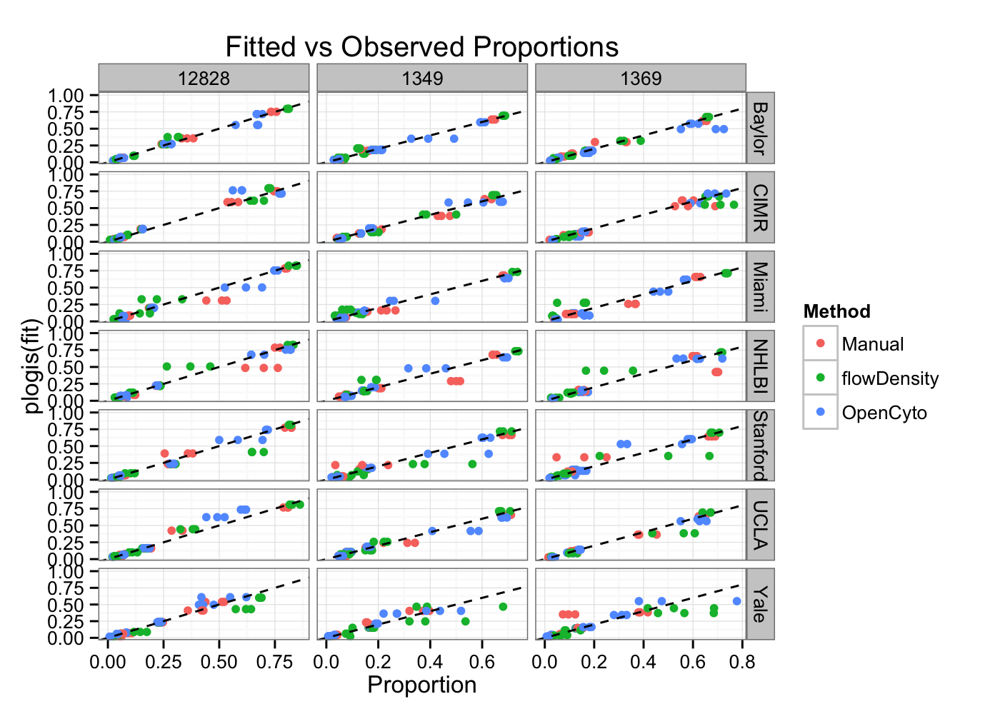
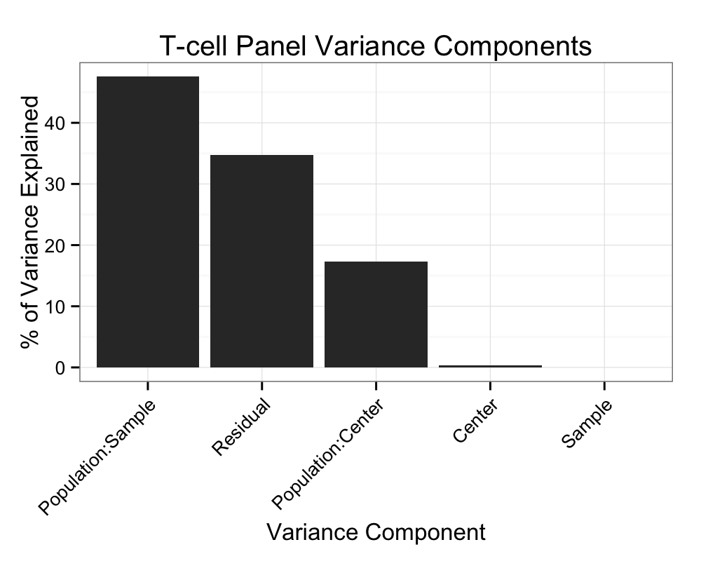
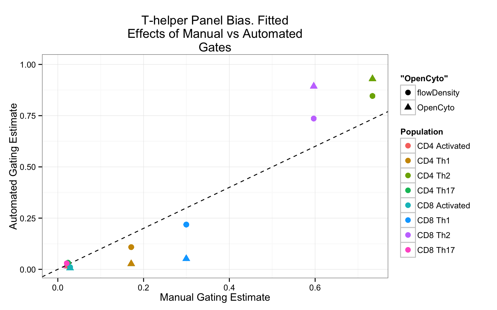

Comparison of Centralized Manual and Automated Gating Methods
========================================================

* We compare OpenCyto and flowDensity against centralized manual gating for the SeraCare Lyoplate samples on five staining panels.  


```r
options(markdown.HTML.header = unlist(sapply(system.file("misc", c("vignette.css", 
    "datatables.txt"), package = "knitr"), readLines)))
```


 
## B-cell panel


```r
summary(BCELL)
```

```
##    Sample         Center                       File            Population 
##  12828:504   Baylor  :216   1228-1_C1_C01.fcs    :  24   Lymphocytes:189  
##  1349 :504   CIMR    :216   1228-2_C2_C02.fcs    :  24   CD19       :189  
##  1369 :504   Miami   :216   1228-3_C3_C03.fcs    :  24   CD20       :189  
##              NHLBI   :216   12828_1_B CELL.fcs   :  24   Naive      :189  
##              Stanford:216   12828_1_Bcell_C01.fcs:  24   Memory IgD+:189  
##              UCLA    :216   12828_2_B CELL.fcs   :  24   Memory IgD-:189  
##              Yale    :216   (Other)              :1368   (Other)    :378  
##    Proportion             Method      Replicate       lp        
##  Min.   :0.0069   Manual     :504   Min.   :1   Min.   :-4.966  
##  1st Qu.:0.0836   flowDensity:504   1st Qu.:1   1st Qu.:-2.394  
##  Median :0.1600   OpenCyto   :504   Median :2   Median :-1.658  
##  Mean   :0.2889                     Mean   :2   Mean   :-0.902  
##  3rd Qu.:0.4754                     3rd Qu.:3   3rd Qu.:-0.099  
##  Max.   :1.0000                     Max.   :3   Max.   :11.513  
##                                                                 
##       logp       
##  Min.   :-4.975  
##  1st Qu.:-2.482  
##  Median :-1.833  
##  Mean   :-1.736  
##  3rd Qu.:-0.744  
##  Max.   : 0.000  
## 
```


* We see that the manual method has more rows and there are some `NAs` in the data


```r
unique(BCELL[is.na(Proportion), list(Center, File, Method)])
```

```
## Empty data.table (0 rows) of 3 cols: Center,File,Method
```

```
## NULL
```

```r
unique(BCELL[Proportion > 1, list(Center, Population, Method)])
```

```
## Empty data.table (0 rows) of 3 cols: Center,Population,Method
```

```
## NULL
```


* The `NAs` come from Yale, and the file is not defined. This seems to be some missing data.
* There are "proportions" greater than 1 for a population that is NA as well. 
* We'll remove these and see if the rest is complete

<table id="bcell_balance">
 <thead>
  <tr>
   <th>   </th>
   <th> Lymphocytes </th>
   <th> CD19 </th>
   <th> CD20 </th>
   <th> Naive </th>
   <th> Memory IgD+ </th>
   <th> Memory IgD- </th>
   <th> Transitional </th>
   <th> Plasmablasts </th>
  </tr>
 </thead>
<tbody>
  <tr>
   <td> Manual </td>
   <td> 63 </td>
   <td> 63 </td>
   <td> 63 </td>
   <td> 63 </td>
   <td> 63 </td>
   <td> 63 </td>
   <td> 63 </td>
   <td> 63 </td>
  </tr>
  <tr>
   <td> flowDensity </td>
   <td> 63 </td>
   <td> 63 </td>
   <td> 63 </td>
   <td> 63 </td>
   <td> 63 </td>
   <td> 63 </td>
   <td> 63 </td>
   <td> 63 </td>
  </tr>
  <tr>
   <td> OpenCyto </td>
   <td> 63 </td>
   <td> 63 </td>
   <td> 63 </td>
   <td> 63 </td>
   <td> 63 </td>
   <td> 63 </td>
   <td> 63 </td>
   <td> 63 </td>
  </tr>
</tbody>
</table>

<br>
* Okay, now things look nicely balanced. We check if the range of the data makes sense for proportions. 


`range(m$value)=[`0.0069, 1`]`

* That looks as expected. We're good to go.

<script type="text/javascript" charset="utf-8">
  $(document).ready(function() {
    $('#bcell_balance').dataTable();
	} );
</script>

* The last thing we need to do is annotation the samples with a technical replicate id.


```r
BCELL[, `:=`(Replicate, gl(nrow(.SD), 1)), list(Sample, Center, Population, 
    Method)]
```

```
##       Sample Center                    File   Population Proportion
##    1:  12828 Baylor      12828_1_B CELL.fcs  Lymphocytes     0.4940
##    2:  12828 Baylor      12828_2_B CELL.fcs  Lymphocytes     0.4840
##    3:  12828 Baylor      12828_3_B CELL.fcs  Lymphocytes     0.4840
##    4:  12828   CIMR     B_CELL_12828_P1.fcs  Lymphocytes     0.4390
##    5:  12828   CIMR B_CELL_12828_001_P1.fcs  Lymphocytes     0.4440
##   ---                                                              
## 1508:   1349  Miami     lot 1349_C5_C05.fcs Plasmablasts     0.2453
## 1509:   1349  Miami     lot 1349_C6_C06.fcs Plasmablasts     0.4194
## 1510:   1369  Miami     lot 1369_C7_C07.fcs Plasmablasts     0.4400
## 1511:   1369  Miami     lot 1369_C8_C08.fcs Plasmablasts     0.4667
## 1512:   1369  Miami     lot 1369_C9_C09.fcs Plasmablasts     0.5000
##         Method Replicate       lp    logp
##    1:   Manual         1 -0.02400 -0.7052
##    2:   Manual         2 -0.06402 -0.7257
##    3:   Manual         3 -0.06402 -0.7257
##    4:   Manual         1 -0.24522 -0.8233
##    5:   Manual         2 -0.22494 -0.8119
##   ---                                    
## 1508: OpenCyto         2 -1.12390 -1.4053
## 1509: OpenCyto         3 -0.32542 -0.8690
## 1510: OpenCyto         1 -0.24116 -0.8210
## 1511: OpenCyto         2 -0.13353 -0.7621
## 1512: OpenCyto         3  0.00000 -0.6931
```


## Mixed effects model for the B-cell panel

We want to model variability between centers, between subjects, and contrast gating methods for each cell population.

### Raw data


```r
df <- cast(BCELL, Sample + Center + Method ~ Population + Replicate, value = "Proportion")
BCELL <- BCELL[, `:=`(lp, logit(Proportion, adjust = 1e-05))]
BCELL <- BCELL[, `:=`(logp, log(Proportion))]
pops <- levels(BCELL$Population)
setkey(BCELL, Population)
ggplot(BCELL[pops[c(3, 5, 8)]]) + geom_boxplot(aes(y = Proportion, x = Center, 
    fill = Method)) + facet_grid(Population ~ Sample, scales = "free") + theme(axis.text.x = element_text(angle = 45, 
    hjust = 1)) + ggtitle("Raw B-cell data")
```

 


How we'll model this is the following. We'll have fixed effects for gating methods, cell populations and their interactions. That is becausewe want to esimate the effec of each gating method on each population.

We fit a random intercept for Sample and Center as well as for each level of Population:Center and Population:Sample. The idea here is that cell population estimates will vary from center to center and from sample to sample, by more than just a fixed offset. 

We fit the reponse (proportions) on the logit scale.


```r
# Estimate fixed effects for population and method and their interaction
# Random effects for center and sample, as random intercept for each
# population:center and population:Sample
mer <- lmer(lp ~ Population * Method + (1 | Center/Population) + (1 | Sample/Population), 
    BCELL[Population != "Lymphocytes"], REML = FALSE, verbose = FALSE)
```


### Model fits and residuals


 


   


### Bias

   


### Variability

 


## Summary of B-cell Panel

We note several things: 
*  First, OpenCyto is slightly biased for the Plasmablast cell population. IT tends to overestimate it compared to the centralized manual gates.
* Second, most of the variability is sample-to-sample biological variability, followed by residual within-sample variation, and then center-to-center variation. 
* The most variable populations are the plasmablasts and the IgD+ subsets.

## T-cell panel.


```
##    Sample         Center                       File     
##  1349 :756   Baylor  :378   1228-1_A1_A01.fcs    :  42  
##  1369 :756   CIMR    :  0   1228-2_A2_A02.fcs    :  42  
##  12828:756   Miami   :378   1228-3_A3_A03.fcs    :  42  
##              NHLBI   :378   12828_1_A1_A01.fcs   :  42  
##              Stanford:378   12828_1_T CELL.fcs   :  42  
##              UCLA    :378   12828_1_Tcell_A01.fcs:  42  
##              Yale    :378   (Other)              :2016  
##               Population     Proportion             Method      Replicate
##  Lymphocytes       : 162   Min.   :0.0004   Manual     :756   Min.   :1  
##  CD3               : 162   1st Qu.:0.0579   flowDensity:756   1st Qu.:1  
##  CD4               : 162   Median :0.3061   OpenCyto   :756   Median :2  
##  CD4 Activated     : 162   Mean   :0.3084                     Mean   :2  
##  CD4 Naive         : 162   3rd Qu.:0.4622                     3rd Qu.:3  
##  CD4 Central Memory: 162   Max.   :1.0000                     Max.   :3  
##  (Other)           :1296                                                 
##        lp              logp       
##  Min.   :-7.788   Min.   :-7.813  
##  1st Qu.:-2.789   1st Qu.:-2.849  
##  Median :-0.819   Median :-1.184  
##  Mean   :-1.144   Mean   :-1.814  
##  3rd Qu.:-0.152   3rd Qu.:-0.772  
##  Max.   :11.513   Max.   : 0.000  
## 
```


* There are some `NAs` again.


```r
m <- melt(TCELLS, id = c("Sample", "Center", "Population", "Method"), measure = "Proportion")
kable(cast(m, Method ~ Population), format = "html", table.attr = "id=\"tcell_balance\"")
```

```
## Aggregation requires fun.aggregate: length used as default
```

<table id="tcell_balance">
 <thead>
  <tr>
   <th>   </th>
   <th> Lymphocytes </th>
   <th> CD3 </th>
   <th> CD4 </th>
   <th> CD4 Activated </th>
   <th> CD4 Naive </th>
   <th> CD4 Central Memory </th>
   <th> CD4 Effector Memory </th>
   <th> CD4 Effector </th>
   <th> CD8 </th>
   <th> CD8 Activated </th>
   <th> CD8 Naive </th>
   <th> CD8 Central Memory </th>
   <th> CD8 Effector Memory </th>
   <th> CD8 Effector </th>
  </tr>
 </thead>
<tbody>
  <tr>
   <td> Manual </td>
   <td> 54 </td>
   <td> 54 </td>
   <td> 54 </td>
   <td> 54 </td>
   <td> 54 </td>
   <td> 54 </td>
   <td> 54 </td>
   <td> 54 </td>
   <td> 54 </td>
   <td> 54 </td>
   <td> 54 </td>
   <td> 54 </td>
   <td> 54 </td>
   <td> 54 </td>
  </tr>
  <tr>
   <td> flowDensity </td>
   <td> 54 </td>
   <td> 54 </td>
   <td> 54 </td>
   <td> 54 </td>
   <td> 54 </td>
   <td> 54 </td>
   <td> 54 </td>
   <td> 54 </td>
   <td> 54 </td>
   <td> 54 </td>
   <td> 54 </td>
   <td> 54 </td>
   <td> 54 </td>
   <td> 54 </td>
  </tr>
  <tr>
   <td> OpenCyto </td>
   <td> 54 </td>
   <td> 54 </td>
   <td> 54 </td>
   <td> 54 </td>
   <td> 54 </td>
   <td> 54 </td>
   <td> 54 </td>
   <td> 54 </td>
   <td> 54 </td>
   <td> 54 </td>
   <td> 54 </td>
   <td> 54 </td>
   <td> 54 </td>
   <td> 54 </td>
  </tr>
</tbody>
</table>

<br>
For some reason there are more observations from flowDensity and Manual gating than OpenCyto.


```r
kable(cast(m, Method ~ Center), format = "html", table.attr = "id=\"tcell_centers\"")
```

```
## Aggregation requires fun.aggregate: length used as default
```

<table id="tcell_centers">
 <thead>
  <tr>
   <th>   </th>
   <th> Baylor </th>
   <th> Miami </th>
   <th> NHLBI </th>
   <th> Stanford </th>
   <th> UCLA </th>
   <th> Yale </th>
  </tr>
 </thead>
<tbody>
  <tr>
   <td> Manual </td>
   <td> 126 </td>
   <td> 126 </td>
   <td> 126 </td>
   <td> 126 </td>
   <td> 126 </td>
   <td> 126 </td>
  </tr>
  <tr>
   <td> flowDensity </td>
   <td> 126 </td>
   <td> 126 </td>
   <td> 126 </td>
   <td> 126 </td>
   <td> 126 </td>
   <td> 126 </td>
  </tr>
  <tr>
   <td> OpenCyto </td>
   <td> 126 </td>
   <td> 126 </td>
   <td> 126 </td>
   <td> 126 </td>
   <td> 126 </td>
   <td> 126 </td>
  </tr>
</tbody>
</table>

* And we see the reason is that OpenCyto gating was not done on CIMR.
* We'll drop CIMR for the purposes of the analysis.

The range of the data looks okay.

`range(m$value)=[`4.0431 &times; 10<sup>-4</sup>, 1`]`


<script type="text/javascript" charset="utf-8">
  $(document).ready(function() {
    $('#tcell_balance').dataTable();
  } );
</script>
<script type="text/javascript" charset="utf-8">
  $(document).ready(function() {
    $('#tcell_center').dataTable();
  } );
</script>

* Annotate the technical replicates.


```r
TCELLS[, `:=`(Replicate, gl(nrow(.SD), 1)), list(Sample, Center, Population, 
    Method)]
```

```
##       Sample Center                     File   Population Proportion
##    1:  12828 Baylor       12828_1_T CELL.fcs  Lymphocytes    0.23800
##    2:  12828 Baylor       12828_2_T CELL.fcs  Lymphocytes    0.49100
##    3:  12828 Baylor       12828_3_T CELL.fcs  Lymphocytes    0.48100
##    4:  12828  Miami     lot 12828_A1_A01.fcs  Lymphocytes    0.61500
##    5:  12828  Miami     lot 12828_A2_A02.fcs  Lymphocytes    0.55700
##   ---                                                               
## 2264:   1349   UCLA TCELL 22013_1349_002.fcs CD8 Effector    0.16178
## 2265:   1349   UCLA TCELL 22013_1349_003.fcs CD8 Effector    0.15292
## 2266:   1369   UCLA TCELL 22013_1369_001.fcs CD8 Effector    0.05122
## 2267:   1369   UCLA TCELL 22013_1369_002.fcs CD8 Effector    0.05292
## 2268:   1369   UCLA TCELL 22013_1369_003.fcs CD8 Effector    0.07474
##         Method Replicate       lp    logp
##    1:   Manual         1 -1.16365 -1.4355
##    2:   Manual         2 -0.03600 -0.7113
##    3:   Manual         3 -0.07604 -0.7319
##    4:   Manual         1  0.46837 -0.4861
##    5:   Manual         2  0.22899 -0.5852
##   ---                                    
## 2264: OpenCyto         2 -1.64499 -1.8215
## 2265: OpenCyto         3 -1.71186 -1.8779
## 2266: OpenCyto         1 -2.91892 -2.9717
## 2267: OpenCyto         2 -2.88437 -2.9389
## 2268: OpenCyto         3 -2.51596 -2.5938
```


## Mixed Model for T-cells


```r
TCELLS <- TCELLS[Center != "CIMR"]  #drop CIMR
df <- cast(TCELLS, Sample + Center + Method ~ Population + Replicate, value = "Proportion")
TCELLS <- TCELLS[, `:=`(lp, logit(Proportion, adjust = 1e-05))]
TCELLS <- TCELLS[, `:=`(logp, log(Proportion))]
pops <- levels(TCELLS$Population)
setkey(TCELLS, Population)
ggplot(TCELLS[pops[c(3, 5, 12)]]) + geom_boxplot(aes(y = Proportion, x = Center, 
    fill = Method)) + facet_grid(Population ~ Sample, scales = "free") + theme(axis.text.x = element_text(angle = 45, 
    hjust = 1)) + ggtitle("Raw T-cell data")
```

 


We fit the mixed model to the T-cell panel.


```r
mer <- lmer(lp ~ Population * Method + (1 | Center/Population) + (1 | Sample/Population), 
    TCELLS[Population != "Lymphocytes"], REML = FALSE, verbose = FALSE)
```


 


   


### Bias

   


### Variability

 


## Summary of T-cell Panel

A couple of the CD8 populations exhibit some bias, but again, they are more consistent across subjects and centers than the manual gating.

#######################################
#######################################


## T-helper Panel


```
##    Sample         Center                            File     
##  1349 :504   Baylor  :216   1228-1_E1_E01.fcs         :  24  
##  1369 :504   CIMR    :216   1228-2_E2_E02.fcs         :  24  
##  12828:504   Miami   :216   1228-3_E3_E03.fcs         :  24  
##              NHLBI   :216   12828_1_E1_E01.fcs        :  24  
##              Stanford:216   12828_1_TH1,2f,2,2f,17.fcs:  24  
##              UCLA    :216   12828_1_Thelper_E01.fcs   :  24  
##              Yale    :216   (Other)                   :1368  
##          Population    Proportion             Method      Replicate
##  CD4 Activated:189   Min.   :0.0001   Manual     :504   Min.   :1  
##  CD4 Th1      :189   1st Qu.:0.0181   flowDensity:504   1st Qu.:1  
##  CD4 Th2      :189   Median :0.0478   OpenCyto   :504   Median :2  
##  CD4 Th17     :189   Mean   :0.2511                     Mean   :2  
##  CD8 Activated:189   3rd Qu.:0.4678                     3rd Qu.:3  
##  CD8 Th1      :189   Max.   :0.9984                     Max.   :3  
##  (Other)      :378                                                 
##        lp              logp       
##  Min.   :-9.044   Min.   :-9.132  
##  1st Qu.:-3.991   1st Qu.:-4.010  
##  Median :-2.992   Median :-3.041  
##  Mean   :-2.125   Mean   :-2.666  
##  3rd Qu.:-0.129   3rd Qu.:-0.760  
##  Max.   : 6.449   Max.   :-0.002  
## 
```


* There are some `NAs` again.


```r
m <- melt(THELPER, id = c("Sample", "Center", "Population", "Method"), measure = "Proportion")
kable(cast(m, Method ~ Population), format = "html", table.attr = "id=\"thelper_balance\"")
```

```
## Aggregation requires fun.aggregate: length used as default
```

<table id="thelper_balance">
 <thead>
  <tr>
   <th>   </th>
   <th> CD4 Activated </th>
   <th> CD4 Th1 </th>
   <th> CD4 Th2 </th>
   <th> CD4 Th17 </th>
   <th> CD8 Activated </th>
   <th> CD8 Th1 </th>
   <th> CD8 Th2 </th>
   <th> CD8 Th17 </th>
  </tr>
 </thead>
<tbody>
  <tr>
   <td> Manual </td>
   <td> 63 </td>
   <td> 63 </td>
   <td> 63 </td>
   <td> 63 </td>
   <td> 63 </td>
   <td> 63 </td>
   <td> 63 </td>
   <td> 63 </td>
  </tr>
  <tr>
   <td> flowDensity </td>
   <td> 63 </td>
   <td> 63 </td>
   <td> 63 </td>
   <td> 63 </td>
   <td> 63 </td>
   <td> 63 </td>
   <td> 63 </td>
   <td> 63 </td>
  </tr>
  <tr>
   <td> OpenCyto </td>
   <td> 63 </td>
   <td> 63 </td>
   <td> 63 </td>
   <td> 63 </td>
   <td> 63 </td>
   <td> 63 </td>
   <td> 63 </td>
   <td> 63 </td>
  </tr>
</tbody>
</table>

<br>


```r
kable(cast(m, Method ~ Center), format = "html", table.attr = "id=\"thelper_centers\"")
```

```
## Aggregation requires fun.aggregate: length used as default
```

<table id="thelper_centers">
 <thead>
  <tr>
   <th>   </th>
   <th> Baylor </th>
   <th> CIMR </th>
   <th> Miami </th>
   <th> NHLBI </th>
   <th> Stanford </th>
   <th> UCLA </th>
   <th> Yale </th>
  </tr>
 </thead>
<tbody>
  <tr>
   <td> Manual </td>
   <td> 72 </td>
   <td> 72 </td>
   <td> 72 </td>
   <td> 72 </td>
   <td> 72 </td>
   <td> 72 </td>
   <td> 72 </td>
  </tr>
  <tr>
   <td> flowDensity </td>
   <td> 72 </td>
   <td> 72 </td>
   <td> 72 </td>
   <td> 72 </td>
   <td> 72 </td>
   <td> 72 </td>
   <td> 72 </td>
  </tr>
  <tr>
   <td> OpenCyto </td>
   <td> 72 </td>
   <td> 72 </td>
   <td> 72 </td>
   <td> 72 </td>
   <td> 72 </td>
   <td> 72 </td>
   <td> 72 </td>
  </tr>
</tbody>
</table>

```r
kable(cast(m, Method ~ Population), format = "html", table.attr = "id=\"thelper_populations\"")
```

```
## Aggregation requires fun.aggregate: length used as default
```

<table id="thelper_populations">
 <thead>
  <tr>
   <th>   </th>
   <th> CD4 Activated </th>
   <th> CD4 Th1 </th>
   <th> CD4 Th2 </th>
   <th> CD4 Th17 </th>
   <th> CD8 Activated </th>
   <th> CD8 Th1 </th>
   <th> CD8 Th2 </th>
   <th> CD8 Th17 </th>
  </tr>
 </thead>
<tbody>
  <tr>
   <td> Manual </td>
   <td> 63 </td>
   <td> 63 </td>
   <td> 63 </td>
   <td> 63 </td>
   <td> 63 </td>
   <td> 63 </td>
   <td> 63 </td>
   <td> 63 </td>
  </tr>
  <tr>
   <td> flowDensity </td>
   <td> 63 </td>
   <td> 63 </td>
   <td> 63 </td>
   <td> 63 </td>
   <td> 63 </td>
   <td> 63 </td>
   <td> 63 </td>
   <td> 63 </td>
  </tr>
  <tr>
   <td> OpenCyto </td>
   <td> 63 </td>
   <td> 63 </td>
   <td> 63 </td>
   <td> 63 </td>
   <td> 63 </td>
   <td> 63 </td>
   <td> 63 </td>
   <td> 63 </td>
  </tr>
</tbody>
</table>

Things look balanced, and we have removed the Lymphocytes, CD8, CD4, and CD3 cells since they are not terminal populations.

The range of the data looks okay.

`range(m$value)=[`1.0811 &times; 10<sup>-4</sup>, 0.9984`]`


<script type="text/javascript" charset="utf-8">
  $(document).ready(function() {
    $('#thelper_balance').dataTable();
  } );
</script>
<script type="text/javascript" charset="utf-8">
  $(document).ready(function() {
    $('#thelper_center').dataTable();
  } );
</script>
<script type="text/javascript" charset="utf-8">
  $(document).ready(function() {
    $('#thelper_populations').dataTable();
  } );
</script>

* Annotate the technical replicates.


```r
THELPER[, `:=`(Replicate, gl(nrow(.SD), 1)), list(Sample, Center, Population, 
    Method)]
```

```
##       Sample Center                          File    Population Proportion
##    1:  12828 Baylor    12828_1_TH1,2f,2,2f,17.fcs CD4 Activated  0.0275000
##    2:  12828 Baylor    12828_2_TH1,2f,2,2f,17.fcs CD4 Activated  0.0317000
##    3:  12828 Baylor    12828_3_TH1,2f,2,2f,17.fcs CD4 Activated  0.0309000
##    4:  12828   CIMR     TH1_TH2_TH17_12828_P1.fcs CD4 Activated  0.0150000
##    5:  12828   CIMR TH1_TH2_TH17_12828_001_P1.fcs CD4 Activated  0.0142000
##   ---                                                                     
## 1508:   1349   CIMR  TH1_TH2_TH17_1349_002_P1.fcs      CD8 Th17  0.0003786
## 1509:   1349   CIMR      TH1_TH2_TH17_1349_P1.fcs      CD8 Th17  0.0003435
## 1510:   1369   CIMR  TH1_TH2_TH17_1369_001_P1.fcs      CD8 Th17  0.0046840
## 1511:   1369   CIMR  TH1_TH2_TH17_1369_002_P1.fcs      CD8 Th17  0.0050342
## 1512:   1369   CIMR      TH1_TH2_TH17_1369_P1.fcs      CD8 Th17  0.0025063
##         Method Replicate     lp   logp
##    1:   Manual         1 -3.565 -3.594
##    2:   Manual         2 -3.419 -3.451
##    3:   Manual         3 -3.445 -3.477
##    4:   Manual         1 -4.184 -4.200
##    5:   Manual         2 -4.240 -4.255
##   ---                                 
## 1508: OpenCyto         2 -7.853 -7.879
## 1509: OpenCyto         3 -7.947 -7.976
## 1510: OpenCyto         1 -5.357 -5.364
## 1511: OpenCyto         2 -5.284 -5.292
## 1512: OpenCyto         3 -5.982 -5.989
```


## Mixed Model for T-helper panel


```r
df <- cast(THELPER, Sample + Center + Method ~ Population + Replicate, value = "Proportion")
THELPER <- THELPER[, `:=`(lp, logit(Proportion, adjust = 1e-05))]
THELPER <- THELPER[, `:=`(logp, log(Proportion))]
pops <- levels((THELPER$Population))
setkey(THELPER, Population)
ggplot(THELPER[pops[c(10, 11, 12)]]) + geom_boxplot(aes(y = Proportion, x = Center, 
    fill = Method)) + facet_grid(Population ~ Sample, scales = "free") + theme(axis.text.x = element_text(angle = 45, 
    hjust = 1)) + ggtitle("Raw T-helper data")
```

 


We fit the mixed model to the T-cell panel.


```r
mer <- lmer(lp ~ Population * Method + (1 | Center/Population) + (1 | Sample/Population), 
    THELPER[Population != "Lymphocytes"], REML = FALSE, verbose = FALSE)
```


 


   


### Bias

   


### Variability

 


## Summary of T-cell Panel

A couple of the CD8 populations exhibit some bias, but again, they are more consistent across subjects and centers than the manual gating.


#######################################
#######################################


## DC / Mono / NK Panel


#######################################
#######################################

## Treg Panel
