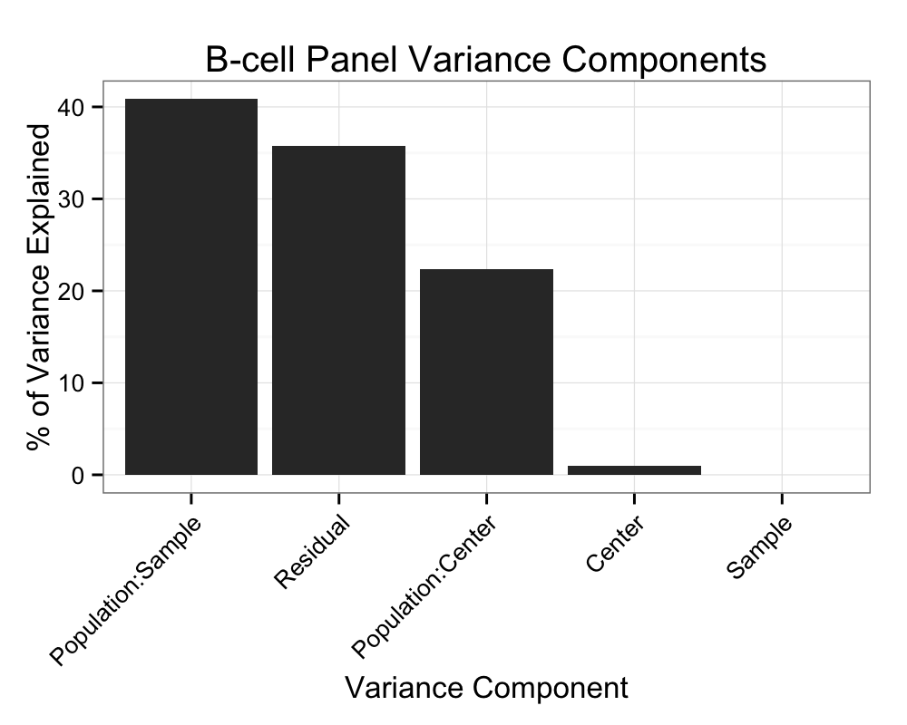
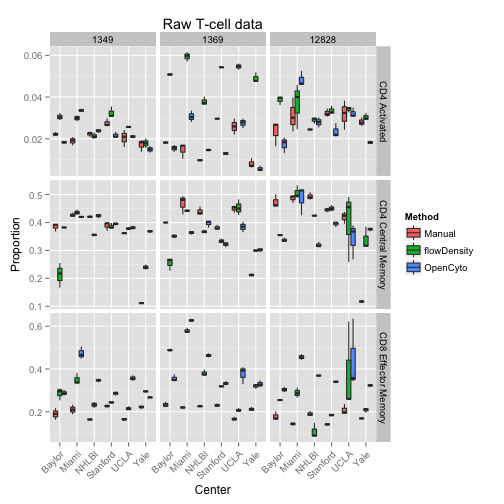
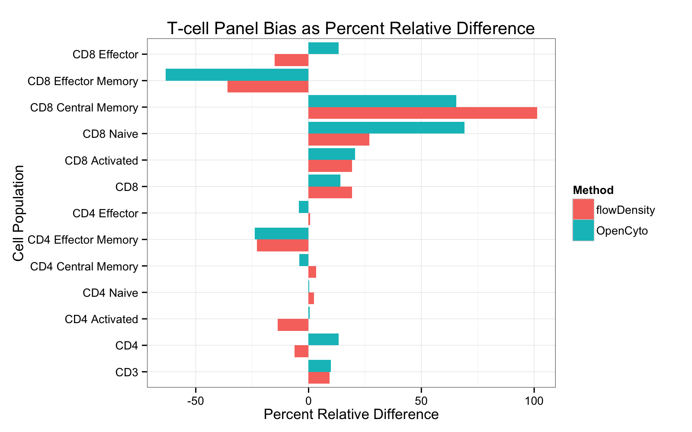
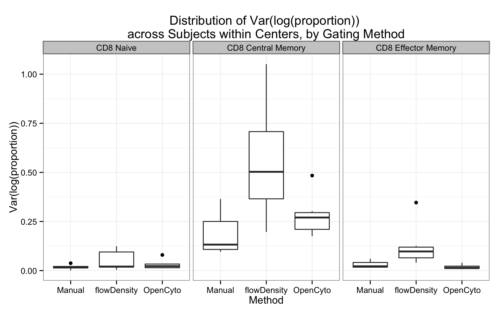
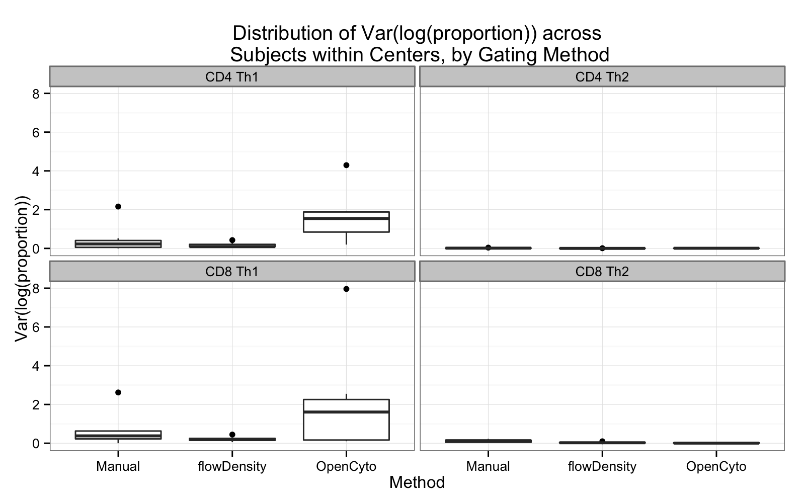
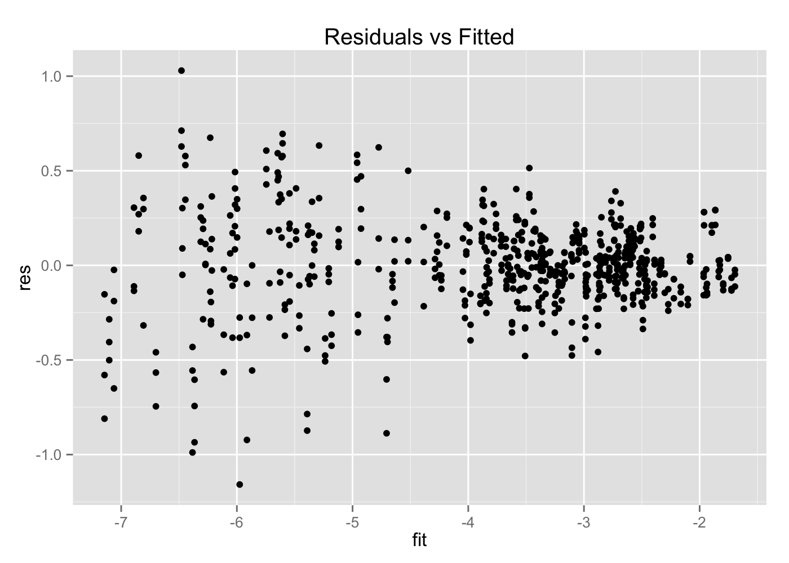
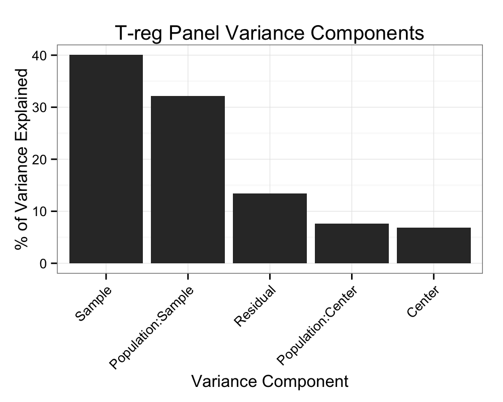

Comparison of Centralized Manual and Automated Gating Methods
========================================================

* We compare OpenCyto and flowDensity against centralized manual gating for the SeraCare Lyoplate samples on five staining panels.  


```r
options(markdown.HTML.header = unlist(sapply(system.file("misc", c("vignette.css", 
    "datatables.txt"), package = "knitr"), readLines)))
```


 
# B-cell panel


```r
summary(BCELL)
```

```
##    Sample         Center                       File            Population 
##  12828:552   Baylor  :225   1228-1_C1_C01.fcs    :  25   Lymphocytes:198  
##  1349 :552   CIMR    :225   1228-2_C2_C02.fcs    :  25   CD19       :198  
##  1369 :552   Miami   :225   1228-3_C3_C03.fcs    :  25   CD20       :198  
##              NHLBI   :225   12828_1_B CELL.fcs   :  25   Naive      :198  
##              Stanford:225   12828_1_Bcell_C01.fcs:  25   Memory IgD+:198  
##              UCLA    :225   (Other)              :1450   (Other)    :594  
##              Yale    :306   NA's                 :  81   NA's       : 72  
##    Proportion             Method   
##  Min.   :  0.01   Manual     :648  
##  1st Qu.:  0.09   flowDensity:504  
##  Median :  0.17   OpenCyto   :504  
##  Mean   :  2.63                    
##  3rd Qu.:  0.56                    
##  Max.   :128.28                    
##  NA's   :72
```


* We see that the manual method has more rows and there are some `NAs` in the data


```r
unique(BCELL[is.na(Proportion), list(Center, File, Method)])
```

```
##    Center File Method
## 1:   Yale   NA Manual
```

```r
unique(BCELL[Proportion > 1, list(Center, Population, Method)])
```

```
##      Center Population Method
## 1:   Baylor         NA Manual
## 2:     CIMR         NA Manual
## 3:    Miami         NA Manual
## 4:    NHLBI         NA Manual
## 5: Stanford         NA Manual
## 6:     UCLA         NA Manual
## 7:     Yale         NA Manual
```


* The `NAs` come from Yale, and the file is not defined. This seems to be some missing data.
* There are "proportions" greater than 1 for a population that is NA as well. 
* We'll remove these and see if the rest is complete

<table id="bcell_balance">
 <thead>
  <tr>
   <th>   </th>
   <th> Lymphocytes </th>
   <th> CD19 </th>
   <th> CD20 </th>
   <th> Naive </th>
   <th> Memory IgD+ </th>
   <th> Memory IgD- </th>
   <th> Transitional </th>
   <th> Plasmablasts </th>
  </tr>
 </thead>
<tbody>
  <tr>
   <td> Manual </td>
   <td> 63 </td>
   <td> 63 </td>
   <td> 63 </td>
   <td> 63 </td>
   <td> 63 </td>
   <td> 63 </td>
   <td> 63 </td>
   <td> 63 </td>
  </tr>
  <tr>
   <td> flowDensity </td>
   <td> 63 </td>
   <td> 63 </td>
   <td> 63 </td>
   <td> 63 </td>
   <td> 63 </td>
   <td> 63 </td>
   <td> 63 </td>
   <td> 63 </td>
  </tr>
  <tr>
   <td> OpenCyto </td>
   <td> 63 </td>
   <td> 63 </td>
   <td> 63 </td>
   <td> 63 </td>
   <td> 63 </td>
   <td> 63 </td>
   <td> 63 </td>
   <td> 63 </td>
  </tr>
</tbody>
</table>

<br>
* Okay, now things look nicely balanced. We check if the range of the data makes sense for proportions. 


`range(m$value)=[`0.0069, 1`]`

* That looks as expected. We're good to go.

<script type="text/javascript" charset="utf-8">
  $(document).ready(function() {
    $('#bcell_balance').dataTable();
	} );
</script>

* The last thing we need to do is annotation the samples with a technical replicate id.


```r
BCELL[, `:=`(Replicate, gl(nrow(.SD), 1)), list(Sample, Center, Population, 
    Method)]
```

```
##       Sample Center                    File   Population Proportion
##    1:  12828 Baylor      12828_1_B CELL.fcs  Lymphocytes    0.49400
##    2:  12828 Baylor      12828_2_B CELL.fcs  Lymphocytes    0.48400
##    3:  12828 Baylor      12828_3_B CELL.fcs  Lymphocytes    0.48400
##    4:  12828   CIMR     B_CELL_12828_P1.fcs  Lymphocytes    0.43900
##    5:  12828   CIMR B_CELL_12828_001_P1.fcs  Lymphocytes    0.44400
##   ---                                                              
## 1508:   1369  Miami     lot 1369_C9_C09.fcs  Memory IgD+    0.16136
## 1509:   1369  Miami     lot 1369_C9_C09.fcs Transitional    0.05231
## 1510:   1369  Miami     lot 1369_C9_C09.fcs         CD20    0.12175
## 1511:   1369  Miami     lot 1369_C9_C09.fcs         CD19    0.11885
## 1512:   1369  Miami     lot 1369_C9_C09.fcs  Lymphocytes    1.00000
##         Method Replicate
##    1:   Manual         1
##    2:   Manual         2
##    3:   Manual         3
##    4:   Manual         1
##    5:   Manual         2
##   ---                   
## 1508: OpenCyto         3
## 1509: OpenCyto         3
## 1510: OpenCyto         3
## 1511: OpenCyto         3
## 1512: OpenCyto         3
```


## Mixed effects model for the B-cell panel

We want to model variability between centers, between subjects, and contrast gating methods for each cell population.

### Raw data


```r
df <- cast(BCELL, Sample + Center + Method ~ Population + Replicate, value = "Proportion")
BCELL <- BCELL[, `:=`(lp, logit(Proportion, adjust = 1e-05))]
BCELL <- BCELL[, `:=`(logp, log(Proportion))]
pops <- levels(BCELL$Population)
setkey(BCELL, Population)
ggplot(BCELL[pops[c(3, 5, 8)]]) + geom_boxplot(aes(y = Proportion, x = Center, 
    fill = Method)) + facet_grid(Population ~ Sample, scales = "free") + theme(axis.text.x = element_text(angle = 45, 
    hjust = 1)) + ggtitle("Raw B-cell data")
```

 


How we'll model this is the following. We'll have fixed effects for gating methods, cell populations and their interactions. That is becausewe want to esimate the effec of each gating method on each population.

We fit a random intercept for Sample and Center as well as for each level of Population:Center and Population:Sample. The idea here is that cell population estimates will vary from center to center and from sample to sample, by more than just a fixed offset. 

We fit the reponse (proportions) on the logit scale.


```r
# Estimate fixed effects for population and method and their interaction
# Random effects for center and sample, as random intercept for each
# population:center and population:Sample
mer <- lmer(lp ~ Population * Method + (1 | Center/Population) + (1 | Sample/Population), 
    BCELL[Population != "Lymphocytes"], REML = FALSE, verbose = FALSE)
```


### Model fits and residuals


 


   


### Bias

   


### Variability

 


## Summary of B-cell Panel

We note several things: 
*  First, OpenCyto is slightly biased for the Plasmablast cell population. IT tends to overestimate it compared to the centralized manual gates.
* Second, most of the variability is sample-to-sample biological variability, followed by residual within-sample variation, and then center-to-center variation. 
* The most variable populations are the plasmablasts and the IgD+ subsets.

# T-cell panel


```
##    Sample         Center                    File     
##  1349 :882   Baylor  :378   1228-1_A1_A01.fcs :  42  
##  1369 :840   CIMR    :252   1228-2_A2_A02.fcs :  42  
##  12828:882   Miami   :378   1228-3_A3_A03.fcs :  42  
##              NHLBI   :378   12828_1_A1_A01.fcs:  42  
##              Stanford:378   12828_1_T CELL.fcs:  42  
##              UCLA    :378   (Other)           :2310  
##              Yale    :462   NA's              :  84  
##               Population     Proportion           Method   
##  Lymphocytes       : 186   Min.   :0.00   Manual     :966  
##  CD3               : 186   1st Qu.:0.06   flowDensity:882  
##  CD4               : 186   Median :0.31   OpenCyto   :756  
##  CD4 Activated     : 186   Mean   :0.31                    
##  CD4 Naive         : 186   3rd Qu.:0.46                    
##  CD4 Central Memory: 186   Max.   :1.00                    
##  (Other)           :1488   NA's   :84
```


* There are some `NAs` again.


```r
m <- melt(TCELLS, id = c("Sample", "Center", "Population", "Method"), measure = "Proportion")
kable(cast(m, Method ~ Population), format = "html", table.attr = "id=\"tcell_balance\"")
```

```
## Aggregation requires fun.aggregate: length used as default
```

<table id="tcell_balance">
 <thead>
  <tr>
   <th>   </th>
   <th> Lymphocytes </th>
   <th> CD3 </th>
   <th> CD4 </th>
   <th> CD4 Activated </th>
   <th> CD4 Naive </th>
   <th> CD4 Central Memory </th>
   <th> CD4 Effector Memory </th>
   <th> CD4 Effector </th>
   <th> CD8 </th>
   <th> CD8 Activated </th>
   <th> CD8 Naive </th>
   <th> CD8 Central Memory </th>
   <th> CD8 Effector Memory </th>
   <th> CD8 Effector </th>
  </tr>
 </thead>
<tbody>
  <tr>
   <td> Manual </td>
   <td> 63 </td>
   <td> 63 </td>
   <td> 63 </td>
   <td> 63 </td>
   <td> 63 </td>
   <td> 63 </td>
   <td> 63 </td>
   <td> 63 </td>
   <td> 63 </td>
   <td> 63 </td>
   <td> 63 </td>
   <td> 63 </td>
   <td> 63 </td>
   <td> 63 </td>
  </tr>
  <tr>
   <td> flowDensity </td>
   <td> 63 </td>
   <td> 63 </td>
   <td> 63 </td>
   <td> 63 </td>
   <td> 63 </td>
   <td> 63 </td>
   <td> 63 </td>
   <td> 63 </td>
   <td> 63 </td>
   <td> 63 </td>
   <td> 63 </td>
   <td> 63 </td>
   <td> 63 </td>
   <td> 63 </td>
  </tr>
  <tr>
   <td> OpenCyto </td>
   <td> 54 </td>
   <td> 54 </td>
   <td> 54 </td>
   <td> 54 </td>
   <td> 54 </td>
   <td> 54 </td>
   <td> 54 </td>
   <td> 54 </td>
   <td> 54 </td>
   <td> 54 </td>
   <td> 54 </td>
   <td> 54 </td>
   <td> 54 </td>
   <td> 54 </td>
  </tr>
</tbody>
</table>

<br>
For some reason there are more observations from flowDensity and Manual gating than OpenCyto.


```r
kable(cast(m, Method ~ Center), format = "html", table.attr = "id=\"tcell_centers\"")
```

```
## Aggregation requires fun.aggregate: length used as default
```

<table id="tcell_centers">
 <thead>
  <tr>
   <th>   </th>
   <th> Baylor </th>
   <th> CIMR </th>
   <th> Miami </th>
   <th> NHLBI </th>
   <th> Stanford </th>
   <th> UCLA </th>
   <th> Yale </th>
  </tr>
 </thead>
<tbody>
  <tr>
   <td> Manual </td>
   <td> 126 </td>
   <td> 126 </td>
   <td> 126 </td>
   <td> 126 </td>
   <td> 126 </td>
   <td> 126 </td>
   <td> 126 </td>
  </tr>
  <tr>
   <td> flowDensity </td>
   <td> 126 </td>
   <td> 126 </td>
   <td> 126 </td>
   <td> 126 </td>
   <td> 126 </td>
   <td> 126 </td>
   <td> 126 </td>
  </tr>
  <tr>
   <td> OpenCyto </td>
   <td> 126 </td>
   <td>   0 </td>
   <td> 126 </td>
   <td> 126 </td>
   <td> 126 </td>
   <td> 126 </td>
   <td> 126 </td>
  </tr>
</tbody>
</table>

* And we see the reason is that OpenCyto gating was not done on CIMR.
* We'll drop CIMR for the purposes of the analysis.

The range of the data looks okay.

`range(m$value)=[`4.0431 &times; 10<sup>-4</sup>, 1`]`


<script type="text/javascript" charset="utf-8">
  $(document).ready(function() {
    $('#tcell_balance').dataTable();
  } );
</script>
<script type="text/javascript" charset="utf-8">
  $(document).ready(function() {
    $('#tcell_center').dataTable();
  } );
</script>

* Annotate the technical replicates.


```r
TCELLS[, `:=`(Replicate, gl(nrow(.SD), 1)), list(Sample, Center, Population, 
    Method)]
```

```
##       Sample Center                     File         Population Proportion
##    1:  12828 Baylor       12828_1_T CELL.fcs        Lymphocytes     0.2380
##    2:  12828 Baylor       12828_2_T CELL.fcs        Lymphocytes     0.4910
##    3:  12828 Baylor       12828_3_T CELL.fcs        Lymphocytes     0.4810
##    4:  12828  Miami     lot 12828_A1_A01.fcs        Lymphocytes     0.6150
##    5:  12828  Miami     lot 12828_A2_A02.fcs        Lymphocytes     0.5570
##   ---                                                                     
## 2516:   1369   UCLA TCELL 22013_1369_003.fcs                CD3     0.7348
## 2517:   1369   UCLA TCELL 22013_1369_003.fcs                CD4     0.6855
## 2518:   1369   UCLA TCELL 22013_1369_003.fcs CD4 Central Memory     0.4022
## 2519:   1369   UCLA TCELL 22013_1369_003.fcs CD8 Central Memory     0.1708
## 2520:   1369   UCLA TCELL 22013_1369_003.fcs        Lymphocytes     1.0000
##         Method Replicate
##    1:   Manual         1
##    2:   Manual         2
##    3:   Manual         3
##    4:   Manual         1
##    5:   Manual         2
##   ---                   
## 2516: OpenCyto         3
## 2517: OpenCyto         3
## 2518: OpenCyto         3
## 2519: OpenCyto         3
## 2520: OpenCyto         3
```


## Mixed Model for T-cell Panel


```r
TCELLS <- TCELLS[Center != "CIMR"]  #drop CIMR
df <- cast(TCELLS, Sample + Center + Method ~ Population + Replicate, value = "Proportion")
TCELLS <- TCELLS[, `:=`(lp, logit(Proportion, adjust = 1e-05))]
TCELLS <- TCELLS[, `:=`(logp, log(Proportion))]
pops <- levels(TCELLS$Population)
setkey(TCELLS, Population)
ggplot(TCELLS[pops[c(3, 5, 12)]]) + geom_boxplot(aes(y = Proportion, x = Center, 
    fill = Method)) + facet_grid(Population ~ Sample, scales = "free") + theme(axis.text.x = element_text(angle = 45, 
    hjust = 1)) + ggtitle("Raw T-cell data")
```

 


We fit the mixed model to the T-cell panel.


```r
mer <- lmer(lp ~ Population * Method + (1 | Center/Population) + (1 | Sample/Population), 
    TCELLS[Population != "Lymphocytes"], REML = FALSE, verbose = FALSE)
```


 


   


### Bias

   


### Variability

 


## Summary of T-cell Panel

A couple of the CD8 populations exhibit some bias, but again, they are more consistent across subjects and centers than the manual gating.

#######################################
#######################################


# T-helper Panel


```
##    Sample         Center                            File     
##  1349 :759   Baylor  :315   1228-1_E1_E01.fcs         :  35  
##  1369 :735   CIMR    :315   1228-2_E2_E02.fcs         :  35  
##  12828:759   Miami   :315   1228-3_E3_E03.fcs         :  35  
##              NHLBI   :315   12828_1_E1_E01.fcs        :  35  
##              Stanford:315   12828_1_TH1,2f,2,2f,17.fcs:  35  
##              UCLA    :315   (Other)                   :2030  
##              Yale    :363   NA's                      :  48  
##          Population     Proportion           Method   
##  CD3          : 193   Min.   :0.00   Manual     :804  
##  CD4          : 193   1st Qu.:0.03   flowDensity:756  
##  CD4 Activated: 193   Median :0.24   OpenCyto   :693  
##  CD4 Th1      : 193   Mean   :0.34                    
##  CD4 Th2      : 193   3rd Qu.:0.62                    
##  CD4 Th17     : 193   Max.   :1.00                    
##  (Other)      :1095   NA's   :48
```


* There are some `NAs` again.


```r
m <- melt(THELPER, id = c("Sample", "Center", "Population", "Method"), measure = "Proportion")
kable(cast(m, Method ~ Population), format = "html", table.attr = "id=\"thelper_balance\"")
```

```
## Aggregation requires fun.aggregate: length used as default
```

<table id="thelper_balance">
 <thead>
  <tr>
   <th>   </th>
   <th> CD4 Activated </th>
   <th> CD4 Th1 </th>
   <th> CD4 Th2 </th>
   <th> CD4 Th17 </th>
   <th> CD8 Activated </th>
   <th> CD8 Th1 </th>
   <th> CD8 Th2 </th>
   <th> CD8 Th17 </th>
  </tr>
 </thead>
<tbody>
  <tr>
   <td> Manual </td>
   <td> 63 </td>
   <td> 63 </td>
   <td> 63 </td>
   <td> 63 </td>
   <td> 63 </td>
   <td> 63 </td>
   <td> 63 </td>
   <td> 63 </td>
  </tr>
  <tr>
   <td> flowDensity </td>
   <td> 63 </td>
   <td> 63 </td>
   <td> 63 </td>
   <td> 63 </td>
   <td> 63 </td>
   <td> 63 </td>
   <td> 63 </td>
   <td> 63 </td>
  </tr>
  <tr>
   <td> OpenCyto </td>
   <td> 63 </td>
   <td> 63 </td>
   <td> 63 </td>
   <td> 63 </td>
   <td> 63 </td>
   <td> 63 </td>
   <td> 63 </td>
   <td> 63 </td>
  </tr>
</tbody>
</table>

<br>


```r
kable(cast(m, Method ~ Center), format = "html", table.attr = "id=\"thelper_centers\"")
```

```
## Aggregation requires fun.aggregate: length used as default
```

<table id="thelper_centers">
 <thead>
  <tr>
   <th>   </th>
   <th> Baylor </th>
   <th> CIMR </th>
   <th> Miami </th>
   <th> NHLBI </th>
   <th> Stanford </th>
   <th> UCLA </th>
   <th> Yale </th>
  </tr>
 </thead>
<tbody>
  <tr>
   <td> Manual </td>
   <td> 72 </td>
   <td> 72 </td>
   <td> 72 </td>
   <td> 72 </td>
   <td> 72 </td>
   <td> 72 </td>
   <td> 72 </td>
  </tr>
  <tr>
   <td> flowDensity </td>
   <td> 72 </td>
   <td> 72 </td>
   <td> 72 </td>
   <td> 72 </td>
   <td> 72 </td>
   <td> 72 </td>
   <td> 72 </td>
  </tr>
  <tr>
   <td> OpenCyto </td>
   <td> 72 </td>
   <td> 72 </td>
   <td> 72 </td>
   <td> 72 </td>
   <td> 72 </td>
   <td> 72 </td>
   <td> 72 </td>
  </tr>
</tbody>
</table>

```r
kable(cast(m, Method ~ Population), format = "html", table.attr = "id=\"thelper_populations\"")
```

```
## Aggregation requires fun.aggregate: length used as default
```

<table id="thelper_populations">
 <thead>
  <tr>
   <th>   </th>
   <th> CD4 Activated </th>
   <th> CD4 Th1 </th>
   <th> CD4 Th2 </th>
   <th> CD4 Th17 </th>
   <th> CD8 Activated </th>
   <th> CD8 Th1 </th>
   <th> CD8 Th2 </th>
   <th> CD8 Th17 </th>
  </tr>
 </thead>
<tbody>
  <tr>
   <td> Manual </td>
   <td> 63 </td>
   <td> 63 </td>
   <td> 63 </td>
   <td> 63 </td>
   <td> 63 </td>
   <td> 63 </td>
   <td> 63 </td>
   <td> 63 </td>
  </tr>
  <tr>
   <td> flowDensity </td>
   <td> 63 </td>
   <td> 63 </td>
   <td> 63 </td>
   <td> 63 </td>
   <td> 63 </td>
   <td> 63 </td>
   <td> 63 </td>
   <td> 63 </td>
  </tr>
  <tr>
   <td> OpenCyto </td>
   <td> 63 </td>
   <td> 63 </td>
   <td> 63 </td>
   <td> 63 </td>
   <td> 63 </td>
   <td> 63 </td>
   <td> 63 </td>
   <td> 63 </td>
  </tr>
</tbody>
</table>

Things look balanced, and we have removed the Lymphocytes, CD8, CD4, and CD3 cells since they are not terminal populations.

The range of the data looks okay.

`range(m$value)=[`1.0811 &times; 10<sup>-4</sup>, 0.9984`]`


<script type="text/javascript" charset="utf-8">
  $(document).ready(function() {
    $('#thelper_balance').dataTable();
  } );
</script>
<script type="text/javascript" charset="utf-8">
  $(document).ready(function() {
    $('#thelper_center').dataTable();
  } );
</script>
<script type="text/javascript" charset="utf-8">
  $(document).ready(function() {
    $('#thelper_populations').dataTable();
  } );
</script>

* Annotate the technical replicates.


```r
THELPER[, `:=`(Replicate, gl(nrow(.SD), 1)), list(Sample, Center, Population, 
    Method)]
```

```
##       Sample Center                          File    Population Proportion
##    1:  12828 Baylor    12828_1_TH1,2f,2,2f,17.fcs CD4 Activated   0.027500
##    2:  12828 Baylor    12828_2_TH1,2f,2,2f,17.fcs CD4 Activated   0.031700
##    3:  12828 Baylor    12828_3_TH1,2f,2,2f,17.fcs CD4 Activated   0.030900
##    4:  12828   CIMR     TH1_TH2_TH17_12828_P1.fcs CD4 Activated   0.015000
##    5:  12828   CIMR TH1_TH2_TH17_12828_001_P1.fcs CD4 Activated   0.014200
##   ---                                                                     
## 1508:   1369   CIMR      TH1_TH2_TH17_1369_P1.fcs       CD4 Th2   0.989839
## 1509:   1369   CIMR      TH1_TH2_TH17_1369_P1.fcs       CD8 Th2   0.988185
## 1510:   1369   CIMR      TH1_TH2_TH17_1369_P1.fcs CD8 Activated   0.008951
## 1511:   1369   CIMR      TH1_TH2_TH17_1369_P1.fcs       CD4 Th1   0.004198
## 1512:   1369   CIMR      TH1_TH2_TH17_1369_P1.fcs       CD8 Th1   0.007966
##         Method Replicate
##    1:   Manual         1
##    2:   Manual         2
##    3:   Manual         3
##    4:   Manual         1
##    5:   Manual         2
##   ---                   
## 1508: OpenCyto         3
## 1509: OpenCyto         3
## 1510: OpenCyto         3
## 1511: OpenCyto         3
## 1512: OpenCyto         3
```


## Mixed Model for T-helper panel


```r
df <- cast(THELPER, Sample + Center + Method ~ Population + Replicate, value = "Proportion")
THELPER <- THELPER[, `:=`(lp, logit(Proportion, adjust = 1e-05))]
THELPER <- THELPER[, `:=`(logp, log(Proportion))]
pops <- levels((THELPER$Population))
setkey(THELPER, Population)
ggplot(THELPER[pops[c(10, 11, 12)]]) + geom_boxplot(aes(y = Proportion, x = Center, 
    fill = Method)) + facet_grid(Population ~ Sample, scales = "free") + theme(axis.text.x = element_text(angle = 45, 
    hjust = 1)) + ggtitle("Raw T-helper data")
```

 


We fit the mixed model to the T-helper panel.


```r
mer <- lmer(lp ~ Population * Method + (1 | Center/Population) + (1 | Sample/Population), 
    THELPER[Population != "Lymphocytes"], REML = FALSE, verbose = FALSE)
```


 


   


### Bias

   


### Variability

 


## Summary of T-helper Panel

The T-helper panel seems to have failed, as we have a lot of bias in the Th1 and Th2 populations.

#######################################
#######################################


# DC / Mono / NK Panel


```
##    Sample         Center                    File              Population 
##  1349 :545   Baylor  :225   12828_3_D3_D03.fcs:  45   CD14+CD16+   :193  
##  1369 :525   CIMR    :225   1349_3_D6_D06.fcs :  45   CD14-Lineage-:193  
##  12828:545   Miami   :225   1228-1_D1_D01.fcs :  25   CD16+CD56+   :193  
##              NHLBI   :225   1228-2_D2_D02.fcs :  25   CD16+CD56-   :193  
##              Stanford:225   1228-3_D3_D03.fcs :  25   HLADR+       :193  
##              UCLA    :225   12828_1_D1_D01.fcs:  25   CD11c-CD123+ :193  
##              Yale    :265   (Other)           :1425   (Other)      :457  
##    Proportion           Method   
##  Min.   :0.00   Manual     :670  
##  1st Qu.:0.11   flowDensity:504  
##  Median :0.26   OpenCyto   :441  
##  Mean   :0.33                    
##  3rd Qu.:0.50                    
##  Max.   :0.99                    
##  NA's   :40
```


* There are some `NAs` again.


```r
m <- melt(DC_MONO, id = c("Sample", "Center", "Population", "Method"), measure = "Proportion")
kable(cast(m, Method ~ Population), format = "html", table.attr = "id=\"dcmono_balance\"")
```

```
## Aggregation requires fun.aggregate: length used as default
```

<table id="dcmono_balance">
 <thead>
  <tr>
   <th>   </th>
   <th> Monocytes </th>
   <th> CD14-Lineage+ </th>
   <th> CD14+CD16+ </th>
   <th> CD14+CD16- </th>
   <th> CD14-Lineage- </th>
   <th> CD16+CD56+ </th>
   <th> CD16+CD56- </th>
   <th> HLADR+ </th>
   <th> CD11c-CD123+ </th>
   <th> CD11c+CD123- </th>
  </tr>
 </thead>
<tbody>
  <tr>
   <td> Manual </td>
   <td> 63 </td>
   <td> 63 </td>
   <td> 63 </td>
   <td> 63 </td>
   <td> 63 </td>
   <td> 63 </td>
   <td> 63 </td>
   <td> 63 </td>
   <td> 63 </td>
   <td> 63 </td>
  </tr>
  <tr>
   <td> flowDensity </td>
   <td> 63 </td>
   <td>  0 </td>
   <td> 63 </td>
   <td>  0 </td>
   <td> 63 </td>
   <td> 63 </td>
   <td> 63 </td>
   <td> 63 </td>
   <td> 63 </td>
   <td> 63 </td>
  </tr>
  <tr>
   <td> OpenCyto </td>
   <td>  0 </td>
   <td>  0 </td>
   <td> 63 </td>
   <td>  0 </td>
   <td> 63 </td>
   <td> 63 </td>
   <td> 63 </td>
   <td> 63 </td>
   <td> 63 </td>
   <td> 63 </td>
  </tr>
</tbody>
</table>

<br>

We are missing some populations. 


```r
kable(cast(m, Method ~ Center), format = "html", table.attr = "id=\"dcmono_centers\"")
```

```
## Aggregation requires fun.aggregate: length used as default
```

<table id="dcmono_centers">
 <thead>
  <tr>
   <th>   </th>
   <th> Baylor </th>
   <th> CIMR </th>
   <th> Miami </th>
   <th> NHLBI </th>
   <th> Stanford </th>
   <th> UCLA </th>
   <th> Yale </th>
  </tr>
 </thead>
<tbody>
  <tr>
   <td> Manual </td>
   <td> 90 </td>
   <td> 90 </td>
   <td> 90 </td>
   <td> 90 </td>
   <td> 90 </td>
   <td> 90 </td>
   <td> 90 </td>
  </tr>
  <tr>
   <td> flowDensity </td>
   <td> 72 </td>
   <td> 72 </td>
   <td> 72 </td>
   <td> 72 </td>
   <td> 72 </td>
   <td> 72 </td>
   <td> 72 </td>
  </tr>
  <tr>
   <td> OpenCyto </td>
   <td> 63 </td>
   <td> 63 </td>
   <td> 63 </td>
   <td> 63 </td>
   <td> 63 </td>
   <td> 63 </td>
   <td> 63 </td>
  </tr>
</tbody>
</table>


```r
DC_MONO <- DC_MONO[!Population %in% c("Monocytes", "CD14-Lineage+", "CD14+CD16-")]
DC_MONO <- DC_MONO[, `:=`(Population, factor(Population))]
m <- melt(DC_MONO, id = c("Sample", "Center", "Population", "Method"), measure = "Proportion")
```


The range of the data looks okay.

`range(m$value)=[`9.4 &times; 10<sup>-4</sup>, 0.898`]`


<script type="text/javascript" charset="utf-8">
  $(document).ready(function() {
    $('#dcmono_balance').dataTable();
  } );
</script>
<script type="text/javascript" charset="utf-8">
  $(document).ready(function() {
    $('#dcmono_center').dataTable();
  } );
</script>

* Annotate the technical replicates.


```r
DC_MONO[, `:=`(Replicate, gl(nrow(.SD), 1)), list(Sample, Center, Population, 
    Method)]
```

```
##       Sample Center                         File    Population Proportion
##    1:  12828 Baylor 12828_1_DC,2f,MONO,2f,NK.fcs    CD14+CD16+    0.01370
##    2:  12828 Baylor 12828_2_DC,2f,MONO,2f,NK.fcs    CD14+CD16+    0.01140
##    3:  12828 Baylor 12828_3_DC,2f,MONO,2f,NK.fcs    CD14+CD16+    0.01180
##    4:  12828   CIMR      DC_MONO_NK_12828001.fcs    CD14+CD16+    0.02380
##    5:  12828   CIMR  DC_MONO_NK_12828001_001.fcs    CD14+CD16+    0.02530
##   ---                                                                    
## 1319:   1369  Miami          lot 1369_D9_D09.fcs    CD14+CD16+    0.01101
## 1320:   1369  Miami          lot 1369_D9_D09.fcs        HLADR+    0.53364
## 1321:   1369  Miami          lot 1369_D9_D09.fcs  CD11c-CD123+    0.63739
## 1322:   1369  Miami          lot 1369_D9_D09.fcs  CD11c+CD123-    0.08522
## 1323:   1369  Miami          lot 1369_D9_D09.fcs CD14-Lineage-    0.12519
##         Method Replicate
##    1:   Manual         1
##    2:   Manual         2
##    3:   Manual         3
##    4:   Manual         1
##    5:   Manual         2
##   ---                   
## 1319: OpenCyto         3
## 1320: OpenCyto         3
## 1321: OpenCyto         3
## 1322: OpenCyto         3
## 1323: OpenCyto         3
```


## Mixed Model for DC/Mono/NK Panel


```r
df <- cast(DC_MONO, Sample + Center + Method ~ Population + Replicate, value = "Proportion")
DC_MONO <- DC_MONO[, `:=`(lp, logit(Proportion, adjust = 1e-05))]
DC_MONO <- DC_MONO[, `:=`(logp, log(Proportion))]
pops <- levels((DC_MONO$Population))
setkey(DC_MONO, Population)
ggplot(DC_MONO[pops[c(1:3)]]) + geom_boxplot(aes(y = Proportion, x = Center, 
    fill = Method)) + facet_grid(Population ~ Sample, scales = "free") + theme(axis.text.x = element_text(angle = 45, 
    hjust = 1)) + ggtitle("Raw DC/Mono/NK data")
```

 


We fit the mixed model to the DC/Mono/NK panel.


```r
mer <- lmer(lp ~ Population * Method + (1 | Center/Population) + (1 | Sample/Population), 
    DC_MONO[Population != "Lymphocytes"], REML = FALSE, verbose = FALSE)
```


 


   


### Bias

   


### Variability

 


## Summary of DC/Mono/NK Panel

* Some bias in some populations.
* Population-specific center-to-center variability is largest, followed by residual variation.


#######################################
#######################################

#  Treg Panel


```
##    Sample         Center                    File           Population 
##  1349 :352   Baylor  :144   1228-1_B1_B01.fcs : 16   Lymphocytes:132  
##  1369 :344   CIMR    :144   1228-2_B2_B02.fcs : 16   CD3        :132  
##  12828:360   Miami   :144   1228-3_B3_B03.fcs : 16   CD4        :132  
##              NHLBI   :144   12828_1_B1_B01.fcs: 16   Lo127Hi25  :132  
##              Stanford:144   12828_1_T REG.fcs : 16   Naive      :132  
##              UCLA    :144   (Other)           :928   Memory     :132  
##              Yale    :192   NA's              : 48   (Other)    :264  
##    Proportion        Method   
##  Min.   :0.00   Manual  :552  
##  1st Qu.:0.02   OpenCyto:504  
##  Median :0.07                 
##  Mean   :0.27                 
##  3rd Qu.:0.55                 
##  Max.   :1.00                 
##  NA's   :48
```


* There are some `NAs` again.


```r
m <- melt(TREG, id = c("Sample", "Center", "Population", "Method"), measure = "Proportion")
kable(cast(m, Method ~ Population), format = "html", table.attr = "id=\"treg_balance\"")
```

```
## Aggregation requires fun.aggregate: length used as default
```

<table id="treg_balance">
 <thead>
  <tr>
   <th>   </th>
   <th> Lymphocytes </th>
   <th> CD3 </th>
   <th> CD4 </th>
   <th> Lo127Hi25 </th>
   <th> Naive </th>
   <th> Memory </th>
   <th> Total Treg </th>
   <th> Activated </th>
  </tr>
 </thead>
<tbody>
  <tr>
   <td> Manual </td>
   <td> 63 </td>
   <td> 63 </td>
   <td> 63 </td>
   <td> 63 </td>
   <td> 63 </td>
   <td> 63 </td>
   <td> 63 </td>
   <td> 63 </td>
  </tr>
  <tr>
   <td> OpenCyto </td>
   <td> 63 </td>
   <td> 63 </td>
   <td> 63 </td>
   <td> 63 </td>
   <td> 63 </td>
   <td> 63 </td>
   <td> 63 </td>
   <td> 63 </td>
  </tr>
</tbody>
</table>

<br>

Populations are balanced.


```r
kable(cast(m, Method ~ Center), format = "html", table.attr = "id=\"treg_centers\"")
```

```
## Aggregation requires fun.aggregate: length used as default
```

<table id="treg_centers">
 <thead>
  <tr>
   <th>   </th>
   <th> Baylor </th>
   <th> CIMR </th>
   <th> Miami </th>
   <th> NHLBI </th>
   <th> Stanford </th>
   <th> UCLA </th>
   <th> Yale </th>
  </tr>
 </thead>
<tbody>
  <tr>
   <td> Manual </td>
   <td> 72 </td>
   <td> 72 </td>
   <td> 72 </td>
   <td> 72 </td>
   <td> 72 </td>
   <td> 72 </td>
   <td> 72 </td>
  </tr>
  <tr>
   <td> OpenCyto </td>
   <td> 72 </td>
   <td> 72 </td>
   <td> 72 </td>
   <td> 72 </td>
   <td> 72 </td>
   <td> 72 </td>
   <td> 72 </td>
  </tr>
</tbody>
</table>


Centers are also balanced 

We drop Lymphocytes, CD3 and CD4.

```r
TREG <- TREG[!Population %in% c("Lymphocytes", "CD3", "CD4")]
TREG <- TREG[, `:=`(Population, factor(Population))]
m <- melt(TREG, id = c("Sample", "Center", "Population", "Method"), measure = "Proportion")
```


The range of the data looks okay.

`range(m$value)=[`3.41 &times; 10<sup>-4</sup>, 0.172`]`


<script type="text/javascript" charset="utf-8">
  $(document).ready(function() {
    $('#treg_balance').dataTable();
  } );
</script>
<script type="text/javascript" charset="utf-8">
  $(document).ready(function() {
    $('#treg_center').dataTable();
  } );
</script>

* Annotate the technical replicates.


```r
TREG[, `:=`(Replicate, gl(nrow(.SD), 1)), list(Sample, Center, Population, Method)]
```

```
##      Sample Center                  File Population Proportion   Method
##   1:  12828 Baylor     12828_1_T REG.fcs  Lo127Hi25   0.131000   Manual
##   2:  12828 Baylor     12828_2_T REG.fcs  Lo127Hi25   0.127000   Manual
##   3:  12828 Baylor     12828_3_T REG.fcs  Lo127Hi25   0.130000   Manual
##   4:  12828   CIMR     TREG_12828_P1.fcs  Lo127Hi25   0.113000   Manual
##   5:  12828   CIMR TREG_12828_001_P1.fcs  Lo127Hi25   0.109000   Manual
##  ---                                                                   
## 626:   1369   CIMR      TREG_1369_P1.fcs     Memory   0.015142 OpenCyto
## 627:   1369   CIMR      TREG_1369_P1.fcs  Lo127Hi25   0.055210 OpenCyto
## 628:   1369   CIMR      TREG_1369_P1.fcs      Naive   0.002060 OpenCyto
## 629:   1369   CIMR      TREG_1369_P1.fcs  Activated   0.000618 OpenCyto
## 630:   1369   CIMR      TREG_1369_P1.fcs Total Treg   0.017202 OpenCyto
##      Replicate
##   1:         1
##   2:         2
##   3:         3
##   4:         1
##   5:         2
##  ---          
## 626:         3
## 627:         3
## 628:         3
## 629:         3
## 630:         3
```


## Mixed Model for T-reg Panel


```r
df <- cast(TREG, Sample + Center + Method ~ Population + Replicate, value = "Proportion")
TREG <- TREG[, `:=`(lp, logit(Proportion, adjust = 1e-05))]
TREG <- TREG[, `:=`(logp, log(Proportion))]
pops <- levels((TREG$Population))
setkey(TREG, Population)
ggplot(TREG[pops[c(1:3, 5)]]) + geom_boxplot(aes(y = Proportion, x = Center, 
    fill = Method)) + facet_grid(Population ~ Sample, scales = "free") + theme(axis.text.x = element_text(angle = 45, 
    hjust = 1)) + ggtitle("Raw DC/Mono/NK data")
```

 


We fit the mixed model to the T-reg panel.


```r
mer <- lmer(lp ~ Population * Method + (1 | Center/Population) + (1 | Sample/Population), 
    TREG[Population != "Lymphocytes"], REML = FALSE, verbose = FALSE)
```


 


   


### Bias


```
## Scale for 'x' is already present. Adding another scale for 'x', which will
## replace the existing scale. Scale for 'y' is already present. Adding
## another scale for 'y', which will replace the existing scale.
```

   


### Variability

 


## Summary of T-reg Panel

* Interestingly, there is a global sample-to-sample shift
* There is also population-specific sample-to-sample variation
* Automated gating is largely unbiased for this panel


# Paper Outline

## Intro and Background

* Motivate the need for standardized reagents and data analysis for flow cytometry in clinical trials. 
* Review the major points from Holden and Phil's previous papers, and the first FlowCAP paper. 
* By bringing together assay standardization efforts and automated gating methods we aim to improve reproducibility and decrease variability and bias.

## Results to present
* Should the first figure show the staining panels and central gating (dotplots) of each panel? Perhaps this is too much page real-estate. Should we just show one or two panels, and the rest in supplementary materials? 
  * Or, do we want to just show the staining panels (reagents) and gating hierarchies, and refer to supplementary materials for centralized gating dotplots. Then we can show specific examples / dotplots comparing centralized and autoamed gating later as necessary.
* Results of centralized vs local gating for Cytotrol data showing that centralized gating decreases variablity.
* Automated gating of Cytotrols showing..
* We at least can reproduce B-cell and T-cell gating in an unbiased manner and with low variablitity compared to central gating.
* SeraCare centralized gating vs automated gating results showing that, at least for some panels:
  * Automated gating is unbiased relative to manual gating
  * Variability is as low or lower than manual gating (decrease in CV)
  * Even when biased, the bias is associated with populations that have low cell counts (to be shown), and even then, CV is lower than manual gating.
  * Show examples of manual gates and automated gates where automated gating improves upon the manual gating
  * Show examples where automated gating is biased, but the gates may still be reasonable. The idea is that the interpretation of the gating is subjective, but it is at least reproducible and data driven in the autoamted gating case.
  * Show what the sources of variability are for the different panels. 
    * i.e. most of the variablity is sample-to-sample biological variability for the B-cell and T-cell and T-reg panels. 
    * Center-to-center variability dominates for the DC/Mono/Nk panel, and within-replicate variability dominates for the T-helper panel.
* Power analysis for each panel. What is the effect size we expect to detect if we use these approaches.
* Can we point to some specific examples (perhaps in the DC/Mono/NK panel where center-to-center variability dominates) where not following SOPs was the cause of the large variability.

### Note that some of the above will certainly reside in the supplementary materials. 

## Discussion
* What do we gain from:
  * standardizing reagents? 
  * centralized analysis?
  * autoamted gating?
* T-helper panel was not really successful, need to discuss why or we exclude it. To be decided.
* What is the impact of the bias we do observe. Is it significant enough to be troublesome, or can we say that the gates are actually reasonable enough and the centralized gating is really succeptible to the same subjectivity as local gating, thus we can trust the automated methods.
* Mention where the tools can be found.
* Discuss what is the impact of following/not following S.O.Ps when running a cross-center trial. 
* Suggest some best practices for using these reagents and tools. Can refer to power analysis, etc.


