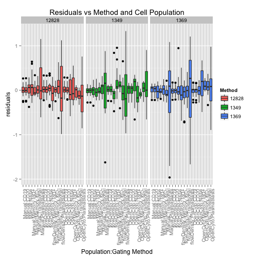
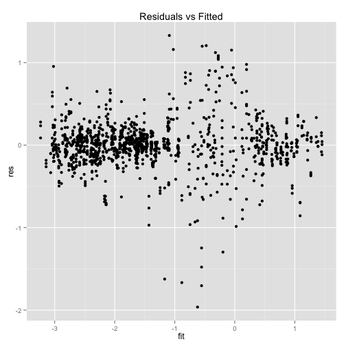
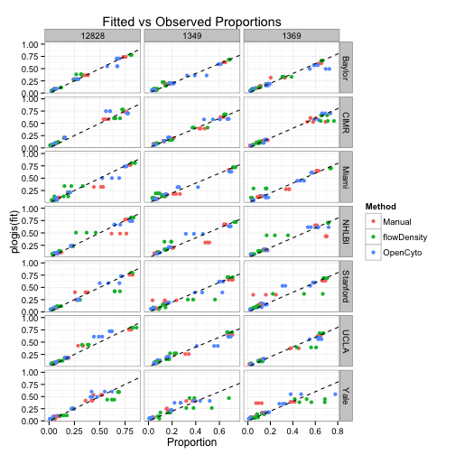

Comparison of Centralized Manual and Automated Gating Methods
========================================================

* We compare OpenCyto and flowDensity against centralized manual gating for the SeraCare Lyoplate samples on five staining panels.  


```r
options(markdown.HTML.header = unlist(sapply(system.file("misc", c("vignette.css", 
    "datatables.txt"), package = "knitr"), readLines)))
```


 
## B-cell panel


```r
summary(BCELL)
```

```
##    Sample         Center                       File            Population 
##  12828:552   Baylor  :225   1228-1_C1_C01.fcs    :  25   Lymphocytes:198  
##  1349 :552   CIMR    :225   1228-2_C2_C02.fcs    :  25   CD19       :198  
##  1369 :552   Miami   :225   1228-3_C3_C03.fcs    :  25   CD20       :198  
##              NHLBI   :225   12828_1_B CELL.fcs   :  25   Naive      :198  
##              Stanford:225   12828_1_Bcell_C01.fcs:  25   Memory IgD+:198  
##              UCLA    :225   (Other)              :1450   (Other)    :594  
##              Yale    :306   NA's                 :  81   NA's       : 72  
##    Proportion             Method   
##  Min.   :  0.01   Manual     :648  
##  1st Qu.:  0.09   flowDensity:504  
##  Median :  0.17   OpenCyto   :504  
##  Mean   :  2.63                    
##  3rd Qu.:  0.56                    
##  Max.   :128.28                    
##  NA's   :72
```


* We see that the manual method has more rows and there are some `NAs` in the data


```r
unique(BCELL[is.na(Proportion), list(Center, File, Method)])
```

```
##    Center File Method
## 1:   Yale   NA Manual
```

```r
unique(BCELL[Proportion > 1, list(Center, Population, Method)])
```

```
##      Center Population Method
## 1:   Baylor         NA Manual
## 2:     CIMR         NA Manual
## 3:    Miami         NA Manual
## 4:    NHLBI         NA Manual
## 5: Stanford         NA Manual
## 6:     UCLA         NA Manual
## 7:     Yale         NA Manual
```


* The `NAs` come from Yale, and the file is not defined. This seems to be some missing data.
* There are "proportions" greater than 1 for a population that is NA as well. 
* We'll remove these and see if the rest is complete

<table id="bcell_balance">
 <thead>
  <tr>
   <th>   </th>
   <th> Lymphocytes </th>
   <th> CD19 </th>
   <th> CD20 </th>
   <th> Naive </th>
   <th> Memory IgD+ </th>
   <th> Memory IgD- </th>
   <th> Transitional </th>
   <th> Plasmablasts </th>
  </tr>
 </thead>
<tbody>
  <tr>
   <td> Manual </td>
   <td> 63 </td>
   <td> 63 </td>
   <td> 63 </td>
   <td> 63 </td>
   <td> 63 </td>
   <td> 63 </td>
   <td> 63 </td>
   <td> 63 </td>
  </tr>
  <tr>
   <td> flowDensity </td>
   <td> 63 </td>
   <td> 63 </td>
   <td> 63 </td>
   <td> 63 </td>
   <td> 63 </td>
   <td> 63 </td>
   <td> 63 </td>
   <td> 63 </td>
  </tr>
  <tr>
   <td> OpenCyto </td>
   <td> 63 </td>
   <td> 63 </td>
   <td> 63 </td>
   <td> 63 </td>
   <td> 63 </td>
   <td> 63 </td>
   <td> 63 </td>
   <td> 63 </td>
  </tr>
</tbody>
</table>

<br>
* Okay, now things look nicely balanced. We check if the range of the data makes sense for proportions. 


`range(m$value)=[`0.0069, 1`]`

* That looks as expected. We're good to go.

<script type="text/javascript" charset="utf-8">
  $(document).ready(function() {
    $('#bcell_balance').dataTable();
	} );
</script>

* The last thing we need to do is annotation the samples with a technical replicate id.


```r
BCELL[, `:=`(Replicate, gl(nrow(.SD), 1)), list(Sample, Center, Population, 
    Method)]
```

```
##       Sample Center                    File   Population Proportion
##    1:  12828 Baylor      12828_1_B CELL.fcs  Lymphocytes    0.49400
##    2:  12828 Baylor      12828_2_B CELL.fcs  Lymphocytes    0.48400
##    3:  12828 Baylor      12828_3_B CELL.fcs  Lymphocytes    0.48400
##    4:  12828   CIMR     B_CELL_12828_P1.fcs  Lymphocytes    0.43900
##    5:  12828   CIMR B_CELL_12828_001_P1.fcs  Lymphocytes    0.44400
##   ---                                                              
## 1508:   1369  Miami     lot 1369_C9_C09.fcs  Memory IgD+    0.16136
## 1509:   1369  Miami     lot 1369_C9_C09.fcs Transitional    0.05231
## 1510:   1369  Miami     lot 1369_C9_C09.fcs         CD20    0.12175
## 1511:   1369  Miami     lot 1369_C9_C09.fcs         CD19    0.11885
## 1512:   1369  Miami     lot 1369_C9_C09.fcs  Lymphocytes    1.00000
##         Method Replicate
##    1:   Manual         1
##    2:   Manual         2
##    3:   Manual         3
##    4:   Manual         1
##    5:   Manual         2
##   ---                   
## 1508: OpenCyto         3
## 1509: OpenCyto         3
## 1510: OpenCyto         3
## 1511: OpenCyto         3
## 1512: OpenCyto         3
```


## ANOVA for the B-cell panel

We want to model variability between centers, between subjects, and contrast gating methods for each cell population.


```r
df <- cast(BCELL, Sample + Center + Method ~ Population + Replicate, value = "Proportion")
BCELL <- BCELL[, `:=`(lp, logit(Proportion))]
```

```
## Warning: proportions remapped to (0.025, 0.975)
```

```r
BCELL <- BCELL[, `:=`(logp, log(Proportion))]
pops <- levels(BCELL$Population)
setkey(BCELL, Population)
ggplot(BCELL[pops[c(3, 5, 8)]]) + geom_boxplot(aes(y = Proportion, x = Center, 
    fill = Method)) + facet_grid(Population ~ Sample, scales = "free") + theme(axis.text.x = element_text(angle = 45, 
    hjust = 1))
```

 


How we'll model this is the following. We'll have fixed effects for gating methods, cell populations and their interactions. That is becausewe want to esimate the effec of each gating method on each population.

We'll have a random intercept for Sample as well as a random term for cell population within each level of Centers:Subjects. The reasoning is that each subject at each center will have some random variation in the cell population proportion caused by technical bias and biological variability donor to donor.  A global shift alone is not expected to account for this variation (and indeed it doesn't), and while we would like to estimate the random population effect for Center and Sample separately, the model is over-specified in that case, and so we fit it for the interaction of Center and Sample.

We fit the reponse (proportions) on the logit scale.


```r
# Estimate fixed effects for population and method and their interaction
# random effects for center and sample, as well as random slope for
# population within center.
mer <- lmer(lp ~ Population * Method + (Population - 1 | Center:Sample) + (1 | 
    Sample), BCELL[Population != "Lymphocytes"])
mer2 <- lmer(lp ~ Population * Method + (1 | Center) + (1 | Sample), BCELL[Population != 
    "Lymphocytes"])

# which model fits better? From Pinhero and Bates.
2 * pchisq(2 * as.numeric(logLik(mer) - logLik(mer2)), 2, lower.tail = FALSE)
```

```
## [1] 5.168e-225
```

```r
# Intercepts alone don't fit as well.

ggplot(data.frame(fit = (fitted(mer)), BCELL[Population != "Lymphocytes", ], 
    res = resid(mer), pg = BCELL[Population != "Lymphocytes", Method:Population])) + 
    geom_boxplot(aes(x = pg, y = fit, fill = Center)) + theme(axis.text.x = element_text(angle = 90, 
    hjust = 1)) + scale_y_continuous("fitted") + scale_x_discrete("Population:Gating Method") + 
    scale_fill_discrete("Method") + ggtitle("Fitted Values (logit proportions) vs Method and Cell Population") + 
    facet_wrap(~Sample, ncol = 1)
```

 

```r

ggplot(data.frame(fit = fitted(mer), BCELL[Population != "Lymphocytes", ], res = resid(mer), 
    pg = BCELL[Population != "Lymphocytes", Method:Population])) + geom_boxplot(aes(x = pg, 
    y = res, fill = Center)) + theme(axis.text.x = element_text(angle = 90, 
    hjust = 1)) + scale_y_continuous("residuals") + scale_x_discrete("Population:Gating Method") + 
    scale_fill_discrete("Method") + ggtitle("Residuals vs Method and Cell Population") + 
    facet_wrap(~Sample, ncol = 1)
```

 

```r

ggplot(data.frame(fit = fitted(mer), BCELL[Population != "Lymphocytes", ], res = resid(mer), 
    pg = BCELL[Population != "Lymphocytes", Method:Population])) + geom_point(aes(x = fit, 
    y = res)) + ggtitle("Residuals vs Fitted")
```

 

```r

ggplot(data.frame(fit = fitted(mer), BCELL[Population != "Lymphocytes", ], res = resid(mer), 
    pg = BCELL[Population != "Lymphocytes", Method:Population])) + geom_point(aes(x = Proportion, 
    y = plogis(fit), col = Method)) + ggtitle("Fitted vs Observed Proportions") + 
    facet_grid(Center ~ Sample, scale = "free") + geom_abline(aes(0, 1), lty = 2) + 
    theme_bw()
```

 

